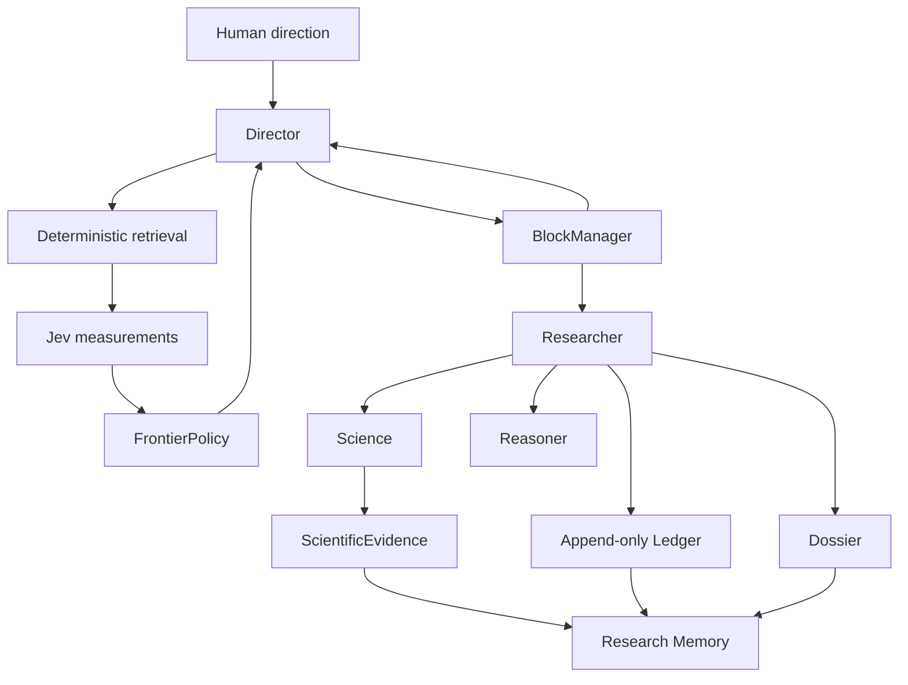

# OncoJev architecture

## Purpose

OncoJev searches large biological information spaces under bounded research allocations. It is a research system, not a predefined GDC workflow or a specialist-agent swarm.

## Runtime shape

Director and Researcher are separate Pydantic AI agents. `BlockManager` is plain deterministic Python, owns hard deadlines, and is the only lifecycle authority. Reasoner is a separately invoked LLM capability, not a third autonomous loop.

## Boundaries

| Concept | Responsibility | Never does |
| --- | --- | --- |
| Science | Deterministic source, cohort, transformation, statistics, validation | Semantic judgment or global allocation |
| Jev | Typed semantic measurements after retrieval and before frontier policy | Evidence admission or agent control |
| Reasoner | Hypotheses, interpretations, possible tests | Evidence admission |
| Researcher | Local investigation inside a block | Extend its block or allocate new global scope |
| Director | Global research allocation | Direct Science admission |
| Python policy | Lifecycle, provenance, admission, composition, frontier | Treat uncertainty as a negative result |

## Search policy

The canonical pattern is deterministic candidate generation, bounded Jev questions, complete distributions, deterministic frontier policy, then Director or Researcher action. A Choice winner is not suitability proof; preserve a beam when ambiguity has material recall risk. Jev failures remain operational failures.

## Evolution

Scientific and Jev capabilities begin local. Only repeat use, validation, provenance, and evaluation justify a reusable registry entry. Skills explain when and how to approach work; registries contain contracts for executable or evaluated artifacts.

## Deferred until a vertical slice needs them

Persistence/API, GDC, scientific sandboxing, capability catalogues, evaluation corpora, and the Next.js observability UI are intentionally deferred. The TypeSafe adapter is present behind `oncojev.jev.client`; the synthetic vertical slice uses its deterministic test implementation so no credential is required. See [UPSTREAM.md](UPSTREAM.md) and [JEV.md](JEV.md).
