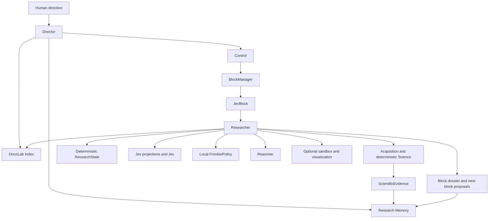
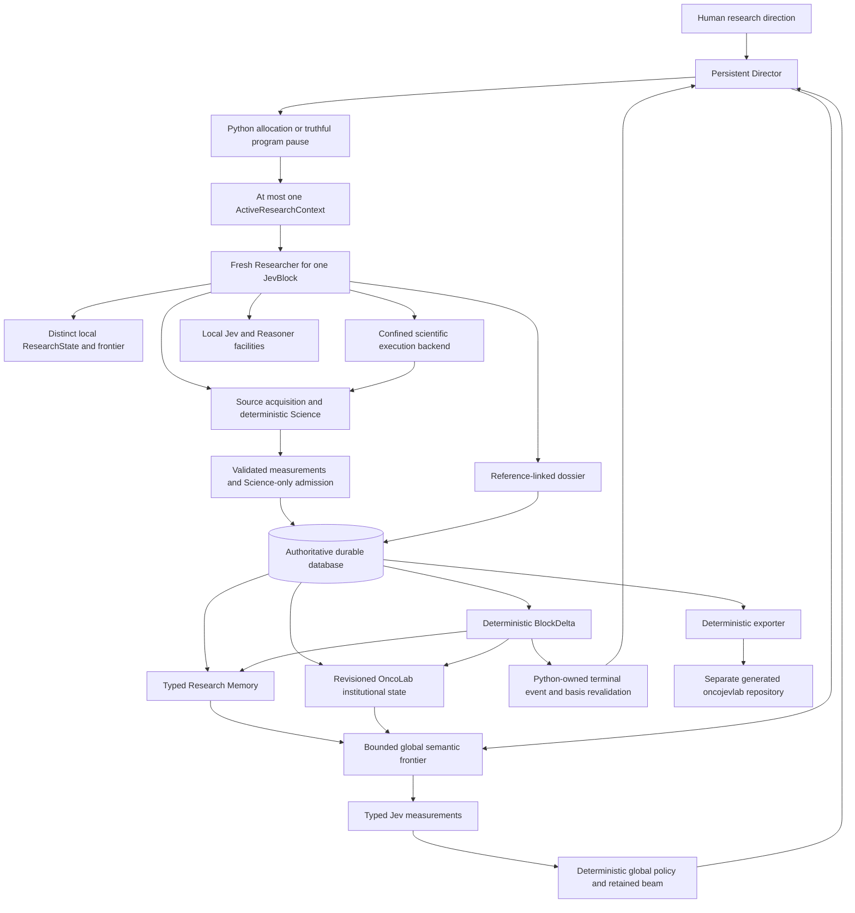

# OncoJev architecture

## Purpose

OncoJev searches large biological information spaces under bounded research allocations. It is a research system, not a predefined GDC workflow or a specialist-agent swarm.

**Architecture status — 2026-10-01:** the bounded F0–F6 delivery is complete, with its original evidence and limits retained in [the completed plan](IMPLEMENTATION_PLAN_COMPLETED_F0_F6.md). The sections before "Next-stage target architecture" describe the delivered baseline. That target section specifies the planned H0–H15 evolution, not implemented behavior. [IMPLEMENTATION_PLAN.md](IMPLEMENTATION_PLAN.md) is the sole active status tracker; [the full supplied target](references/NEXT_STAGE_AUTONOMOUS_LAB_REQUIREMENTS.md) preserves every requirement. This file remains the single canonical architecture document.

## Two architectural scopes

The global scope contains only Director Control, the OncoLab Index, and Research Memory. Control includes global allocation and deterministic block lifecycle. Director and Researcher are separate Pydantic AI agents. `BlockManager` owns soft handoff deadlines and per-block budgets. Entering the handoff window prevents new expensive work but never cancels an in-flight operation.

Each JevBlock is the Researcher’s local scope. It contains capability discovery/use, acquisition, deterministic science, deterministic ResearchState, Jev projections/measurement, local deterministic frontier policy, Reasoner, optional sandboxed software, visualization, and dossier construction. There are no separate global Science, source, Jev, visualization, or sandbox planes.

## Agent harness

In Linux, both agents compose Pydantic AI Harness `Coder` with `CodeMode`. The Director retains Coder in `/work/director` for scratch engineering. Each JevBlock receives a fresh writable Researcher workspace under `var/workspaces/<block-id>` for code, public GitHub repositories, and local investigation. The application tree is read-only to both coding contexts. A command-only workspace backend sends native file tools and shell commands through a Linux Landlock launcher; descendants inherit access restrictions. Only selected public application paths and system dependencies are readable, and only the role's own workspace is writable. Peer workspaces, application credential files and `/proc` environment files are excluded; command environments omit provider secrets and cannot be overridden by tools. The runtime image uses an unprivileged user and root-owned application source. Coding fails closed when Landlock ABI 3 or newer is unavailable. Network access for scratch engineering is separate from the credential-free scientific Docker replay sandbox. Code Mode exposes typed acquisition, Science, Jev, evidence, and lifecycle tools; only those typed paths can admit evidence. Windows development retains Monty Code Mode; validate Coder behavior through the Linux container verifier.

Production composition enforces configured allocation bounds (300–3600 seconds, default 900) and a 90-second reserve. Director model/tool headroom is independent of Researcher headroom. Nested and fallback Researcher launches receive explicit limits and independent usage objects; live Reasoner requests also consume the Researcher's allocation. Cycle-wide request, tool-attempt and optional reported-cost limits cover all roles. Resource exhaustion returns a structured non-retryable handoff directive before effects; inspection and Python finalization remain available, while in-flight work finishes. SDK request exhaustion terminates the bounded run and retains the failed receipt. Ledger `ResourceAttempt`, `WorkNotStarted` and `ModelUsage` records expose attempted work, remaining local counters and role usage. Missing provider cost remains unknown and cannot establish a complete monetary bound.

Every block begins with a fresh immutable `ResearchState`. Exact public acquisitions and literature context are persisted before use, with stable content hashes independent of execution UUIDs. Science resolves acquisitions within their owning block. Typed summaries feed bounded, versioned Jev projections containing origin, references, limitations and explicit omission counts; Jev never receives provider JSON, dataframes, or shell output. The factory loads bundled and validated durable execution verifications into the shared OncoLab Index without resuming research or promoting descriptors. Index discovery and selection have durable actor/scope receipts, including Director discovery before allocation.

Researcher procedural skills are selected locally and afresh per JevBlock. They are short guidance, not executable capabilities or standing prompt context. When a missing method requires public GitHub software, the repository is resolved to a commit and run only in a credential-free Docker sandbox. Full requests, inputs, resolved image identity, commands, outputs and validator version survive restart. Independent replay is explicit and compares output hashes through the same isolated executor. Dependency installation is currently unlocked and disclosed in the environment receipt; replay can fail when those dependencies drift. Raw stdout and files cannot become evidence.

## Boundaries

| Concept | Responsibility | Never does |
| --- | --- | --- |
| Science | Deterministic block-local source, cohort, transformation, statistics, validation | Semantic judgment or global allocation |
| Jev | Typed semantic measurements after bounded retrieval and before deterministic frontier policy | Evidence admission or agent control |
| Reasoner | Block-local hypotheses, interpretations, possible tests | Evidence admission |
| Researcher | Local investigation and facilities inside one JevBlock | Extend its block or allocate new global scope |
| Director | Global Control, OncoLab Index search, and Research Memory use, including existing typed memory semantics | Direct scientific acquisition/analysis/admission or unrestricted Jev operation |
| Python policy | Lifecycle, provenance, admission, composition, frontier | Treat uncertainty as a negative result |

## Search policy

Inside a JevBlock, the canonical pattern is deterministic candidate generation, bounded Jev questions, complete distributions, deterministic local frontier policy, then Researcher action or a proposal to Director. A Choice winner is not suitability proof; preserve a beam when ambiguity has material recall risk. Jev failures remain operational failures.

Each Jev call retains its projection and question specifications, hashes, requested/resolved model, timing, reported usage and outcome. SDK construction and decoding failures retain operational receipts and produce no frontier judgment. Candidate history links native distributions and deterministic policy rationale to the originating call; semantic rejection never establishes a scientific negative.

## Live and deterministic modes

One composition point, `src/runtime/pydantic_ai/factory.py`, constructs the autonomous live system from strict repository-owned configuration. Missing provider credentials fail closed. Deterministic clients exist only as explicit test fixtures. The Reasoner is an independent Pydantic AI sub-agent, and TypeSafe failures are operational (`JevOperationalFailure`), never decisions.

`AutonomousService` owns one Director Agent for its process lifetime and passes it
back through factory composition. Each cycle still has a new runtime and each
block a fresh Researcher, state, skills and budgets. Previous Director messages
are not retained; durable structured memory is authoritative after restart.

## Persistence and application API

`src/persistence/` writes block, ledger, state, measurement, evidence, Jev, artifact, and dossier records as work occurs into append-only SQLite. Block closure and its terminal dossier are committed atomically and idempotently. A durable cycle-start receipt and mission-linked block records let recovery finish a missing cycle receipt after an interrupted write sequence. Recovery runs at startup and before every service cycle, closes interrupted blocks with a current-time recovery event and partial dossier, and never resumes research. A dossier alone does not establish closure. `src/application/service.py` assembles read models, and `src/api/server.py` exposes them read-only.

Lifecycle closure, Researcher run outcome, Director outcome, and scientific objective attainment are separate contracts. Under the no-retry contract, each block permits one Researcher launch. `complete_block` records a handoff request; only `ResearcherRunCompleted` permits successful finalization. Any `ResearcherRunFailed` overrides a normal Director return. Hard Director errors and invalid allocation counts close all allocated blocks as failed and preserve partial dossiers before propagating the error; pre-allocation failure records a failed cycle without inventing a block. Only installed `UsageLimitExceeded` and `IncompleteToolCall` exceptions qualify as Director truncation, which produces an incomplete cycle even after a completed Researcher run. Authentication, transport, tool crashes and generic `UnexpectedModelBehavior` remain hard failures. Objective attainment defaults to unknown; neither model prose nor a completed run establishes a scientific estimate.

Effective reconstruction and API views give failure receipts precedence over contradictory legacy completion. Recovery appends an outcome correction linked to original block, ledger, dossier and cycle sequence numbers. Original cycles, dossiers, measurements and evidence remain unchanged. Legacy completion without a Researcher completion receipt is explicitly inferred as unverified/interrupted. This applies to historical block 4 as well as any matching history.

`src/memory/` appends versioned cycle digests from resolvable records, including
failed and pre-allocation outcomes. References pin kind, sequence, identity,
owner and content hash. New corrections produce new derived snapshots; old
records remain intact. Missing historical inputs and legacy prose are explicitly
labelled. Search ranks structured context deterministically, with stable ties and
mission/entity/topic/time filters. Entity/topic tags are declared at allocation.
Retrieved context is bounded to 32 KiB and start memory to 16 KiB, with omissions
and truncation marked. Director and Researcher can resolve historical dossiers,
evidence, hypotheses and open uncertainties from persistence. Scientific negatives
have their own field; current Science outputs do not declare such interpretations,
so no negatives are inferred from missing evidence, failure or semantic rejection.

Allocation retrieves context for the actual objective and stores selected
references, prior failures, uncertainty, candidate directions and limitations in
the start packet. Both launch paths deliver it to the fresh Researcher without
inheriting admission authority or prior transcripts. API reads expose bounded
typed outcomes with derived summary/provenance compatibility fields; archive prose
without a digest is labelled unverified context. API reads never backfill memory.

## Observability and evaluation

`web/` is a dynamic Next.js App Router interface that reads the live API server-side and uses the committed snapshot only as an offline fallback. `src/evals/` runs fresh autonomous conditions and reports source-bound evidence, failed/incomplete cycles, condition failures, verified run completion, and elapsed time without declaring a winner. Failed conditions retain partial measurements/evidence and continue to remaining conditions. Custom-runner failures receive a condition failure outcome without duplicating an already-recorded cycle.

## Evolution

Scientific and Jev capabilities begin local. Only repeat use, validation, provenance, and evaluation justify a reusable registry entry. Skills explain when and how to approach work; registries contain contracts for executable or evaluated artifacts. See [UPSTREAM.md](UPSTREAM.md), [JEV.md](JEV.md), and [FRONTEND.md](FRONTEND.md).

F4 discovery uses shared OncoLab cards, snapshot-bound continuation and explicit contract expansion. Researcher suitability extends the existing frontier; Python checks route, access and inputs. Semantic Research Memory follows bounded F3 retrieval with separate global budgets and deterministic fallback. Director Control receives context, not scientific acquisition authority. Terminal dossier construction never requires successful Jev annotation.

ScientificArtifact stores exact bytes, source/request identity, byte hash, size,
format and block ownership independently of analysis identity. Retained inputs
live in append-only persistence, outside disposable Coder workspaces. Runtime
resolves owner/hash before sandbox input mounting and validation. Source analysis
resolves fields and paired entity rows deterministically from owned acquisitions.
Analysis keys bind content, design, population, estimand, fields and transformations;
admission uses stable scoped identity and explicit replication identity. No
persistence or presentation component admits evidence.

F6 operational retention runs between service cycles, outside agent authority.
It requires durable terminal records, resolves archive identity before removing
scratch and excludes active/unknown/unresolved or linked paths. All evidence,
retained source bytes, replay inputs and history remain durable. Persistence
failures prevent export-driven cleanup; deletion/receipt failures are explicit.
Read models distinguish synthetic provenance and source attempt/success/failure
counts; API connectivity never establishes scientific success.

## Next-stage target architecture — PLANNED

The next stage extends delivered F0–F6 rather than rebuilding their semantic, scientific or operational contracts. It remains a cumulative scientific decision system: semantic judgment guides search and comparison without becoming evidence or execution authority. No new global Science/Jev agent or specialist swarm is introduced.

BlockDelta feeding OncoLab records demand, usage, failure and proposal history; it never directly accepts a promotion. Python governance alone creates accepted registry revisions. The diagram's evidence/storage arrows do not grant persistence or exporters admission authority. `oncojevlab` has no reverse scientific input path.

### Service lifetime, ownership and events

One Railway service owns the read-only API, authoritative repository, typed Research Memory, revisioned OncoLab and one persistent Director Agent. Director transcripts need not grow across blocks: durable typed program context is the continuity mechanism. At most one active fresh Researcher has a block-local workspace, skills, state, budgets and usage. Pydantic AI remains integrated only under `src/runtime/pydantic_ai/`; `factory.py` remains the sole deterministic/live composition point.

Python schedules and owns the Researcher task. Start returns an active-run identity immediately instead of awaiting the whole run inside a Director tool. The minimum active context records mission/cycle/block/run identity, exact OncoLab revision, application/runtime version, independent budgets/usage, lifecycle/task state and starting database high-water sequence. Director global work reads bounded persisted context and cannot change the active block's objective, state, deadline, pinned contracts or workspace. Atomic single-active and one-launch-per-block guards preserve the no-swarm/no-retry boundary.

Asynchronous scheduling must also handle blocking source/Jev/scientific subprocess operations and safe SQLite/budget ownership; putting synchronous work inside an asyncio task is insufficient. One authoritative state/transaction owner preserves ordering while isolated bounded operations run without starving the Director. No distributed queue or workflow engine is needed.

Python supplies useful bounded turns on Researcher start, explicitly material persisted events, completion/failure and bounded scheduled review. When independent global work is exhausted, Director yields and Python awaits events. Researcher wall-clock time does not authorize continuous Director model activity. Completion/failure receipts, atomic terminal dossier, delta/memory refresh and post-block events are idempotent; reserve windows stop new expensive work while in-flight work and finalization finish. Recovery closes interruption honestly and never silently resumes research.

### Director program decisions and semantic scope

Director asks what the laboratory should do next overall: memory synthesis, global hypothesis portfolio, uncertainty/contradiction/cross-block frontiers, duplicate research detection, dependencies/diversification, resource/failure/concentration review, capability gaps and engineering proposals. Researcher asks how to investigate inside its current block and retains source/method/representation/analysis selection, local Jev/Reasoner use, candidate generation, compatible software acquisition, scope-escalation proposals and local completion. Director allocates a question rather than a fixed pipeline.

Global search follows deterministic high-recall retrieval, exact normalized duplicate checks, bounded typed candidates/projections, atomic Jev dimensions, native distributions, deterministic global policy and a small retained beam. Future investigations originate from continuations, hypotheses, uncertainties, contradictions, relation candidates, replication needs, capability gaps and underexplored mission areas. Jev measures mission relevance, uncertainty linkage, duplication, continuation/contradiction coherence, dependency/block fit, method fit and potential hypothesis distinction/material state change; Python composes and Director decides. A single "which is best" score is insufficient.

Global and local frontiers may reuse measurement primitives, projection infrastructure and receipts. They have distinct candidate contracts, authority, scope, stop conditions, policy identities and threshold interpretations. Deterministic fallback preserves alternatives when Jev fails. Retrieval blocks comparison by entity/topic/capability/hypothesis/shared references/time/terms/lineage; never compare the full database all-pairs.

Global hypotheses distinguish exact duplicates, paraphrases, related distinct claims, independent replication, contradiction, blocked/newly testable/deferred/resolved status. Cross-block relation candidates retain source references, type/status, Jev receipts/distributions, basis sequence/memory revision and limitations. Contradiction context distinguishes population, design, method and phrasing differences and preserves both originals. These are testing opportunities, not admitted evidence or scientific negatives. Program review is typed descriptive context, not a universal quality score or self-reward loop.

Prepared frontiers record memory digest IDs, database high-water sequence, active block/revision, OncoLab revision and application version. After terminal/material revision events, Python revalidates that basis before allocation; stale plans cannot execute blindly. Explicit program ALLOCATE or PAUSE outcomes permit NO_MATERIAL_NEXT_BLOCK/NEEDS_HUMAN_DIRECTION and other truthful reasons. A pause creates no dummy block and proves no scientific success. Allocate turns remain bounded to one block; zero allocation without an explicit pause remains a distinct operational/incomplete outcome. CLI/API consumers must handle both outcomes honestly.

### Harness authority and proposals

Both roles retain Coder and CodeMode/Monty. Director uses writable `/work/director` for temporary bounded exported-state analysis, calculations, metadata comparisons and engineering proposal prototypes. Application source/config/policy/questions/prompts/deployment remain read-only; peer workspaces and credentials are denied. Coder cannot mutate evidence, authoritative registry state or lifecycle. Scratch output is neither Science nor evidence, and no Engineer agent or live self-modification is introduced.

Director receives typed MEMORY, SEMANTIC, ONCOLAB and CONTROL tools plus existing confined Coder capabilities. Memory resolves historical references; semantic tools analyze memory/hypotheses/relations/contradictions/block candidates/program review; OncoLab tools inspect history/gaps/external candidates and propose governed changes; Control allocates/starts/inspects/reads completed work/pauses. Tool names adapt existing owners. There is no direct evidence-admission tool or generic unrestricted Jev escape hatch.

Separate model requests, provider/tool attempts, CodeMode, Jev calls/questions, Reasoner/source/scientific executions, download bytes and aggregate usage remain bounded. Independent Director work has its own configured allowance. Reported monetary cost may remain unknown; expose configured bound and known/unknown status without invented provider pricing.

### BlockDelta and authoritative memory

The deterministic BlockDelta answers what changed because of a block. It links new evidence/measurement/hypothesis/scientific-negative references, uncertainties and explicitly recorded resolutions, continuation proposals, operational blockers, capability demand/gaps, candidate contradictions/relations and resource delta to their originating records and start/end sequence. Prefer references to duplicated payloads and mark omissions. Do not infer a negative, resolution or scientific interpretation from missing evidence or operational/semantic failure.

The authoritative database stores immutable history. Research Memory derives typed, resolvable bounded context for Director and Researcher. OncoLab derives institutional capability knowledge and governs reusable state. The generated notebook serves human reading. Dossiers and memory/program summaries do not become evidence. New infrastructure cannot retroactively recover old absent artifacts or certify their replayability.

### Revisioned OncoLab and discovery layers

Preserve static descriptors, schemas, execution routes, governance, cards, snapshots, pagination and verification as seed knowledge. Add durable dynamic history of use, successful scopes, failures, limitations, demand, suitability, gaps and promotion/review/reverification. Immutable revisions retain parent/content identity and accepted governance transitions; historical revisions are reconstructable. Blocks pin registry and application/runtime version, and refresh occurs between blocks without restarting the service or reinterpreting old decisions against new routes.

Three layers remain distinct: curated/promoted capabilities; bounded external capability discovery; scientific data assets. Current OncoLab retrieval→cards→contract expansion→deterministic route/input/access checks→Jev suitability→retained alternatives precedes external discovery when a need remains unmet. External bio.tools/GitHub/Bioconda/Bioconductor metadata is non-authoritative candidate information; listing does not prove installation, compatibility, validity, permitted use or reusability. Returned EDAM IDs/terms support bounded normalization without whole-ontology ingestion. Bioconda enriches compatibility/dependency metadata without mandating Conda; Bioconductor remains metadata-only without verified R support.

GDC discovery produces data-asset records with query/page/order/total/access/category/type/format/strategy/size/hash/release and case/project identity where available. Individual file UUIDs never become capabilities. Search visibility may distinguish controlled/unknown assets, while anonymous acquisition remains explicitly open-only. Selected files use the existing exact-byte artifact bridge, supplied MD5/size validation, internal SHA-256 and block ownership. Useful representations group actual retrievable formats/entity units/coverage/transformations before semantic sufficiency; no universal artificial ladder. Controlled access requires separately supported scientific-data credentials and cannot be attempted silently.

Capability gaps and proposals link actual needs/attempts/external candidates/failures. Versioned deterministic governance accepts or rejects scoped declarative promotion based on contracts, repeated validated use, generalization/replay/dependencies/access/licence knowledge/measured utility and overlap; a count or execution receipt alone is insufficient. Rejection changes no registry. Supported declarative reuse can produce a new revision without source edits. A parser/wrapper/algorithm/route/source/admission change produces EngineeringProposal for ordinary development. No unrestricted agent CRUD or automatic Jev/local-question/self-promotion.

Search scaling is earned by recall/latency/coverage/size/context/continuation measurements: keep current deterministic retrieval where adequate, then smallest justified FTS/vocabulary support, then embeddings only for measured additional recall. Do not bulk harvest or create vector infrastructure as a prerequisite. D1–D8 are integrated into the active H-phase implementation batches: H4 generators/hypotheses, H6 representations/schema, H7 measured search expansion, H9 governed promotion, H10 selected scientific operations/dependency locking and H14 shared-generator/calibration experiments. H13 evaluations return to those owners before final acceptance. Original triggers govern execution; an unmet gate is recorded in the owning phase without claiming delivery or creating a separate backlog.

### Scientific execution and deployment

One backend-neutral scientific execution/validation contract extends the existing exact artifact/replay/admission bridge. The target Railway backend uses a confined per-experiment local Python venv; Docker may remain for local verification under the same contract. Research dependencies never enter the application `.venv` or another block's environment. Initially support compatible Python repositories only; R/Conda/CUDA/Docker-required methods/system daemons remain unsupported unless separately implemented and verified.

A venv isolates dependencies, not authority. Scientific subprocesses and descendants require actual filesystem/process/credential confinement, owned output paths, read-only exact inputs/application, bounded resources and explicit network behavior. Preserve independent model-provider/scientific-data authentication and keep publisher credentials separate from both scratch/execution environments. Unsupported confinement fails closed rather than relaxing the scientific contract.

Experiment identity retains repository/commit/package, application/backend/Python/OS-base runtime, dependency resolution/lock identity, install/test/execute commands, input references/hashes, parameters, output hashes, first/replay runs, validator and limitations. Local identity does not fabricate an immutable Docker image digest. Prefer lockfile/pinned requirements/reproducibly resolved dependencies; freeze/hash is a recorded fallback with limits, not automatic reinstall proof. Reusable promotion requires actual fresh-environment replay and supported identity. Coder stdout/code/prose/plots remain ineligible until a declared experiment passes deterministic execution/replay, Science validation and explicit admission.

One worker and durable SQLite are the initial design. Railway must point `ONCOJEV_DB_PATH` at verified persistent storage and expose configured/verified/unknown durability status without secrets. Normal block/memory/registry/review/export changes require no restart; only application changes require redeploy. Actual deployed Landlock ABI, role workspace writes, app read-only, peer/credential denial, environment scrubbing and descendant confinement must be verified, alongside the scientific backend. Windows tests/local container proof cannot certify Railway. Missing or failed deployed verification is an explicit blocker.

F6 archive-before-cleanup remains canonical. Experiment repositories/venvs/temporary outputs may be removed only after required artifacts, receipts, measurements/evidence, dependency/environment identity, registry revisions, memory and ledger are durable. Active/unresolved/unsafe workspaces and failed exports remain excluded. `/work/director` is outside block-retention semantics.

### Generated oncojevlab and evaluation

`asimog/oncojevlab` is a separate deterministic human-readable laboratory history, rendered only from persisted typed records at a pinned sequence/revision. Useful populated paths cover program direction/frontier/uncertainties/contradictions, block summary/dossier JSON, hypotheses, capability state/gaps/revisions/proposals, program reviews and engineering proposals. Label evidence, measurements, hypotheses, semantic judgments, Director decisions and failures distinctly, with authoritative reference IDs. Director does not edit notebook Markdown; notebook contents never write back scientific truth.

Export/publication commits occur at defined material boundaries, with deterministic messages and no-op deduplication, not every model turn. GitHub failure or absent setup records a downstream publication failure/requirement, preserves exports and authoritative state and cannot roll back evidence or block terminal finalization. Publisher credentials stay outside Coder/scientific environments.

Correctness tests protect executable authority/lifecycle/identity/failure contracts. Labelled evaluations separately measure retrieval/representation/capability recall and suitability, duplicates vs independent replication, hypothesis alignment, cross-block relations/contradictions, memory/actionable uncertainty, retained alternatives/diversity, unique source-bound outcomes and operational/resource use. Compare deterministic, Reasoner where appropriate, Jev and full-system conditions with versions/native distributions and resource differences. Labels remain evaluation data, never evidence. Calibrations/self-consistency/Autoresearch require measured instability and budget justification; no universal reward score or improvement claim from a tiny smoke.
