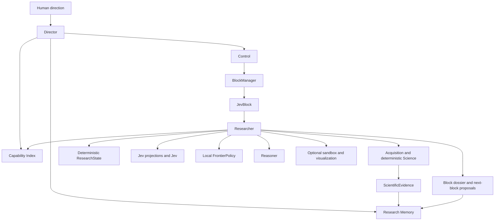

# OncoJev architecture

## Purpose

OncoJev searches large biological information spaces under bounded research allocations. It is a research system, not a predefined GDC workflow or a specialist-agent swarm.

## Two architectural scopes

The global scope contains only Director Control, the Capability Index, and Research Memory. Control includes global allocation and deterministic block lifecycle. Director and Researcher are separate Pydantic AI agents. `BlockManager` is plain deterministic Python, owns hard deadlines and budgets, and is the only lifecycle authority.

Each JevBlock is the Researcher’s local scope. It contains capability discovery/use, acquisition, deterministic science, deterministic ResearchState, Jev projections/measurement, local deterministic frontier policy, Reasoner, optional sandboxed software, visualization, and dossier construction. There are no separate global Science, source, Jev, visualization, or sandbox planes.

## Agent harness

Both agents use Pydantic AI Harness `CodeMode(tools="all")`. Model-written Python runs in Monty and can orchestrate typed role-specific contract tools. Both also receive raw workspace file and shell tools on this Windows checkout; those tools are workspace-contained and cannot read `.env*`. The Director allocates, inspects, and launches bounded JevBlocks. The Researcher operates the block-local facilities. There is no deadline-extension tool.

Every block begins with a fresh immutable `ResearchState`. Public-provider records are reduced into typed summaries before state update. Jev receives only a deterministic JSON projection of that state, identified by a content-derived projection ID; it never receives provider JSON, dataframes, or shell output. Proven executions are recorded separately under `registries/capabilities/proven/`; this does not promote a broad Capability Index descriptor into a reusable capability.

## Boundaries

| Concept | Responsibility | Never does |
| --- | --- | --- |
| Science | Deterministic block-local source, cohort, transformation, statistics, validation | Semantic judgment or global allocation |
| Jev | Block-local typed semantic measurements after retrieval and before frontier policy | Evidence admission or agent control |
| Reasoner | Block-local hypotheses, interpretations, possible tests | Evidence admission |
| Researcher | Local investigation and facilities inside one JevBlock | Extend its block or allocate new global scope |
| Director | Global Control, Capability Index search, and Research Memory use | Direct science, source, Jev, visualization, or sandbox operation |
| Python policy | Lifecycle, provenance, admission, composition, frontier | Treat uncertainty as a negative result |

## Search policy

Inside a JevBlock, the canonical pattern is deterministic candidate generation, bounded Jev questions, complete distributions, deterministic local frontier policy, then Researcher action or a proposal to Director. A Choice winner is not suitability proof; preserve a beam when ambiguity has material recall risk. Jev failures remain operational failures.

## Evolution

Scientific and Jev capabilities begin local. Only repeat use, validation, provenance, and evaluation justify a reusable registry entry. Skills explain when and how to approach work; registries contain contracts for executable or evaluated artifacts.

## Deferred until a vertical slice needs them

Persistence/API, GDC, scientific sandboxing, capability catalogues, evaluation corpora, and the Next.js observability UI are intentionally deferred. The TypeSafe adapter is present behind `jev.client`; the synthetic vertical slice uses its deterministic test implementation so no credential is required. See [UPSTREAM.md](UPSTREAM.md) and [JEV.md](JEV.md).
