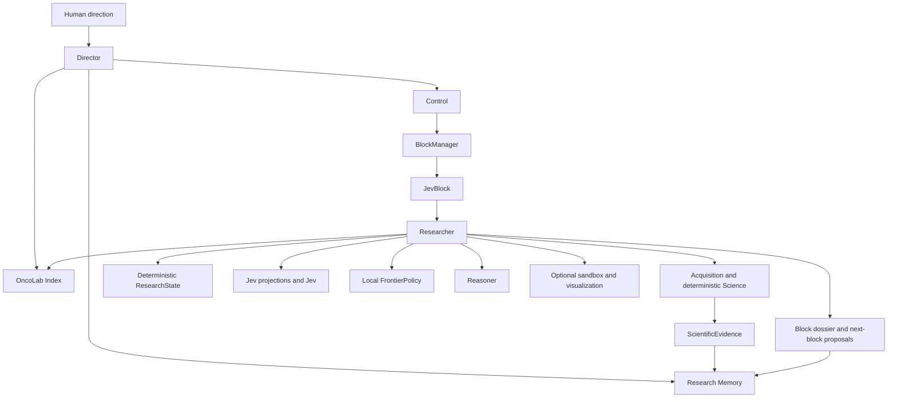

# OncoJev architecture

## Purpose

OncoJev searches large biological information spaces under bounded research allocations. It is a research system, not a predefined GDC workflow or a specialist-agent swarm.

## Two architectural scopes

The global scope contains only Director Control, the OncoLab Index, and Research Memory. Control includes global allocation and deterministic block lifecycle. Director and Researcher are separate Pydantic AI agents. `BlockManager` owns soft handoff deadlines and per-block budgets. Entering the handoff window prevents new expensive work but never cancels an in-flight operation.

Each JevBlock is the Researcher’s local scope. It contains capability discovery/use, acquisition, deterministic science, deterministic ResearchState, Jev projections/measurement, local deterministic frontier policy, Reasoner, optional sandboxed software, visualization, and dossier construction. There are no separate global Science, source, Jev, visualization, or sandbox planes.

## Agent harness

In the Railway/Linux deployment, both agents compose Pydantic AI Harness `Coder` with `CodeMode`. The Director receives a writable repository-root workspace and unrestricted shell. Each JevBlock receives a fresh writable Researcher workspace under `var/workspaces/<block-id>` for code, public GitHub repositories, and local investigation. Child commands receive a scrubbed environment. Code Mode exposes typed acquisition, Science, Jev, evidence, and lifecycle tools; only those typed paths can admit evidence. Windows local development retains Monty Code Mode because Pydantic AI's `LocalWorkspace` backend is POSIX-only; validate Coder behavior through the Docker image.

Every block begins with a fresh immutable `ResearchState`. Public-provider records are reduced into typed summaries before state update. Jev receives only a deterministic JSON projection of that state, identified by a content-derived projection ID; it never receives provider JSON, dataframes, or shell output. Proven executions are bundled under `src/oncolab/proven/` and loaded by the shared OncoLab Index; this does not promote a broad OncoLab descriptor into a reusable capability.

Researcher procedural skills are selected locally and afresh per JevBlock. They are short guidance, not executable capabilities or standing prompt context. When a missing method requires public GitHub software, the repository is resolved to a commit and run only in a credential-free Docker sandbox. The sandbox captures command, environment, input/output hashes, and exit status; raw stdout and files cannot become evidence.

## Boundaries

| Concept | Responsibility | Never does |
| --- | --- | --- |
| Science | Deterministic block-local source, cohort, transformation, statistics, validation | Semantic judgment or global allocation |
| Jev | Block-local typed semantic measurements after retrieval and before frontier policy | Evidence admission or agent control |
| Reasoner | Block-local hypotheses, interpretations, possible tests | Evidence admission |
| Researcher | Local investigation and facilities inside one JevBlock | Extend its block or allocate new global scope |
| Director | Global Control, OncoLab Index search, and Research Memory use | Direct science, source, Jev, visualization, or sandbox operation |
| Python policy | Lifecycle, provenance, admission, composition, frontier | Treat uncertainty as a negative result |

## Search policy

Inside a JevBlock, the canonical pattern is deterministic candidate generation, bounded Jev questions, complete distributions, deterministic local frontier policy, then Researcher action or a proposal to Director. A Choice winner is not suitability proof; preserve a beam when ambiguity has material recall risk. Jev failures remain operational failures.

## Live and deterministic modes

One composition point, `src/runtime/pydantic_ai/factory.py`, constructs the autonomous live system from strict repository-owned configuration. Missing provider credentials fail closed. Deterministic clients exist only as explicit test fixtures. The Reasoner is an independent Pydantic AI sub-agent, and TypeSafe failures are operational (`JevOperationalFailure`), never decisions.

## Persistence and application API

`src/persistence/` writes block, ledger, state, measurement, evidence, Jev, artifact, and dossier records as work occurs into append-only SQLite. Startup closes interrupted active blocks with an explicit recovery dossier rather than silently resuming or losing them. `src/application/service.py` assembles read models, and `src/api/server.py` exposes them read-only.

## Observability and evaluation

`web/` is a dynamic Next.js App Router interface that reads the live API server-side and uses the committed snapshot only as an offline fallback. `src/evals/` runs fresh autonomous conditions and reports source-bound evidence, failures, completion, and elapsed time without declaring a winner.

## Evolution

Scientific and Jev capabilities begin local. Only repeat use, validation, provenance, and evaluation justify a reusable registry entry. Skills explain when and how to approach work; registries contain contracts for executable or evaluated artifacts. See [UPSTREAM.md](UPSTREAM.md), [JEV.md](JEV.md), and [FRONTEND.md](FRONTEND.md).
