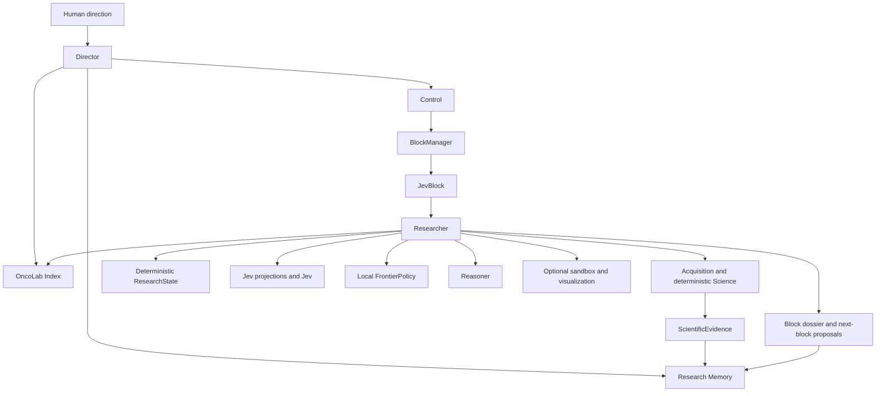

# OncoJev architecture

## Purpose

OncoJev searches large biological information spaces under bounded research allocations. It is a research system, not a predefined GDC workflow or a specialist-agent swarm.

## Two architectural scopes

The global scope contains only Director Control, the OncoLab Index, and Research Memory. Control includes global allocation and deterministic block lifecycle. Director and Researcher are separate Pydantic AI agents. `BlockManager` owns soft handoff deadlines and per-block budgets. Entering the handoff window prevents new expensive work but never cancels an in-flight operation.

Each JevBlock is the Researcher’s local scope. It contains capability discovery/use, acquisition, deterministic science, deterministic ResearchState, Jev projections/measurement, local deterministic frontier policy, Reasoner, optional sandboxed software, visualization, and dossier construction. There are no separate global Science, source, Jev, visualization, or sandbox planes.

## Agent harness

In Linux, both agents compose Pydantic AI Harness `Coder` with `CodeMode`. The Director retains Coder in `/work/director` for scratch engineering. Each JevBlock receives a fresh writable Researcher workspace under `var/workspaces/<block-id>` for code, public GitHub repositories, and local investigation. The application tree is read-only to both coding contexts. A command-only workspace backend sends native file tools and shell commands through a Linux Landlock launcher; descendants inherit access restrictions. Only selected public application paths and system dependencies are readable, and only the role's own workspace is writable. Peer workspaces, application credential files and `/proc` environment files are excluded; command environments omit provider secrets and cannot be overridden by tools. The runtime image uses an unprivileged user and root-owned application source. Coding fails closed when Landlock ABI 3 or newer is unavailable. Network access for scratch engineering is separate from the credential-free scientific Docker replay sandbox. Code Mode exposes typed acquisition, Science, Jev, evidence, and lifecycle tools; only those typed paths can admit evidence. Windows development retains Monty Code Mode; validate Coder behavior through the Linux container verifier.

Production composition enforces configured allocation bounds (300–3600 seconds, default 900) and a 90-second reserve. Director model/tool headroom is independent of Researcher headroom. Nested and fallback Researcher launches receive explicit limits and independent usage objects; live Reasoner requests also consume the Researcher's allocation. Cycle-wide request, tool-attempt and optional reported-cost limits cover all roles. Resource exhaustion returns a structured non-retryable handoff directive before effects; inspection and Python finalization remain available, while in-flight work finishes. SDK request exhaustion terminates the bounded run and retains the failed receipt. Ledger `ResourceAttempt`, `WorkNotStarted` and `ModelUsage` records expose attempted work, remaining local counters and role usage. Missing provider cost remains unknown and cannot establish a complete monetary bound.

Every block begins with a fresh immutable `ResearchState`. Exact public acquisitions and literature context are persisted before use, with stable content hashes independent of execution UUIDs. Science resolves acquisitions within their owning block. Typed summaries feed bounded, versioned Jev projections containing origin, references, limitations and explicit omission counts; Jev never receives provider JSON, dataframes, or shell output. The factory loads bundled and validated durable execution verifications into the shared OncoLab Index without resuming research or promoting descriptors. Index discovery and selection have durable actor/scope receipts, including Director discovery before allocation.

Researcher procedural skills are selected locally and afresh per JevBlock. They are short guidance, not executable capabilities or standing prompt context. When a missing method requires public GitHub software, the repository is resolved to a commit and run only in a credential-free Docker sandbox. Full requests, inputs, resolved image identity, commands, outputs and validator version survive restart. Independent replay is explicit and compares output hashes through the same isolated executor. Dependency installation is currently unlocked and disclosed in the environment receipt; replay can fail when those dependencies drift. Raw stdout and files cannot become evidence.

## Boundaries

| Concept | Responsibility | Never does |
| --- | --- | --- |
| Science | Deterministic block-local source, cohort, transformation, statistics, validation | Semantic judgment or global allocation |
| Jev | Block-local typed semantic measurements after retrieval and before frontier policy | Evidence admission or agent control |
| Reasoner | Block-local hypotheses, interpretations, possible tests | Evidence admission |
| Researcher | Local investigation and facilities inside one JevBlock | Extend its block or allocate new global scope |
| Director | Global Control, OncoLab Index search, and Research Memory use | Direct science, source, Jev, visualization, or sandbox operation |
| Python policy | Lifecycle, provenance, admission, composition, frontier | Treat uncertainty as a negative result |

## Search policy

Inside a JevBlock, the canonical pattern is deterministic candidate generation, bounded Jev questions, complete distributions, deterministic local frontier policy, then Researcher action or a proposal to Director. A Choice winner is not suitability proof; preserve a beam when ambiguity has material recall risk. Jev failures remain operational failures.

Each Jev call retains its projection and question specifications, hashes, requested/resolved model, timing, reported usage and outcome. SDK construction and decoding failures retain operational receipts and produce no frontier judgment. Candidate history links native distributions and deterministic policy rationale to the originating call; semantic rejection never establishes a scientific negative.

## Live and deterministic modes

One composition point, `src/runtime/pydantic_ai/factory.py`, constructs the autonomous live system from strict repository-owned configuration. Missing provider credentials fail closed. Deterministic clients exist only as explicit test fixtures. The Reasoner is an independent Pydantic AI sub-agent, and TypeSafe failures are operational (`JevOperationalFailure`), never decisions.

`AutonomousService` owns one Director Agent for its process lifetime and passes it
back through factory composition. Each cycle still has a new runtime and each
block a fresh Researcher, state, skills and budgets. Previous Director messages
are not retained; durable structured memory is authoritative after restart.

## Persistence and application API

`src/persistence/` writes block, ledger, state, measurement, evidence, Jev, artifact, and dossier records as work occurs into append-only SQLite. Block closure and its terminal dossier are committed atomically and idempotently. A durable cycle-start receipt and mission-linked block records let recovery finish a missing cycle receipt after an interrupted write sequence. Recovery runs at startup and before every service cycle, closes interrupted blocks with a current-time recovery event and partial dossier, and never resumes research. A dossier alone does not establish closure. `src/application/service.py` assembles read models, and `src/api/server.py` exposes them read-only.

Lifecycle closure, Researcher run outcome, Director outcome, and scientific objective attainment are separate contracts. Under the no-retry contract, each block permits one Researcher launch. `complete_block` records a handoff request; only `ResearcherRunCompleted` permits successful finalization. Any `ResearcherRunFailed` overrides a normal Director return. Hard Director errors and invalid allocation counts close all allocated blocks as failed and preserve partial dossiers before propagating the error; pre-allocation failure records a failed cycle without inventing a block. Only installed `UsageLimitExceeded` and `IncompleteToolCall` exceptions qualify as Director truncation, which produces an incomplete cycle even after a completed Researcher run. Authentication, transport, tool crashes and generic `UnexpectedModelBehavior` remain hard failures. Objective attainment defaults to unknown; neither model prose nor a completed run establishes a scientific estimate.

Effective reconstruction and API views give failure receipts precedence over contradictory legacy completion. Recovery appends an outcome correction linked to original block, ledger, dossier and cycle sequence numbers. Original cycles, dossiers, measurements and evidence remain unchanged. Legacy completion without a Researcher completion receipt is explicitly inferred as unverified/interrupted. This applies to historical block 4 as well as any matching history.

`src/memory/` appends versioned cycle digests from resolvable records, including
failed and pre-allocation outcomes. References pin kind, sequence, identity,
owner and content hash. New corrections produce new derived snapshots; old
records remain intact. Missing historical inputs and legacy prose are explicitly
labelled. Search ranks structured context deterministically, with stable ties and
mission/entity/topic/time filters. Entity/topic tags are declared at allocation.
Retrieved context is bounded to 32 KiB and start memory to 16 KiB, with omissions
and truncation marked. Director and Researcher can resolve historical dossiers,
evidence, hypotheses and open uncertainties from persistence. Scientific negatives
have their own field; current Science outputs do not declare such interpretations,
so no negatives are inferred from missing evidence, failure or semantic rejection.

Allocation retrieves context for the actual objective and stores selected
references, prior failures, uncertainty, candidate directions and limitations in
the start packet. Both launch paths deliver it to the fresh Researcher without
inheriting admission authority or prior transcripts. API reads expose bounded
typed outcomes with derived summary/provenance compatibility fields; archive prose
without a digest is labelled unverified context. API reads never backfill memory.

## Observability and evaluation

`web/` is a dynamic Next.js App Router interface that reads the live API server-side and uses the committed snapshot only as an offline fallback. `src/evals/` runs fresh autonomous conditions and reports source-bound evidence, failed/incomplete cycles, condition failures, verified run completion, and elapsed time without declaring a winner. Failed conditions retain partial measurements/evidence and continue to remaining conditions. Custom-runner failures receive a condition failure outcome without duplicating an already-recorded cycle.

## Evolution

Scientific and Jev capabilities begin local. Only repeat use, validation, provenance, and evaluation justify a reusable registry entry. Skills explain when and how to approach work; registries contain contracts for executable or evaluated artifacts. See [UPSTREAM.md](UPSTREAM.md), [JEV.md](JEV.md), and [FRONTEND.md](FRONTEND.md).

F4 discovery uses shared OncoLab cards, snapshot-bound continuation and explicit contract expansion. Researcher suitability extends the existing frontier; Python checks route, access and inputs. Semantic Research Memory follows bounded F3 retrieval with separate global budgets and deterministic fallback. Director Control receives context, not scientific acquisition authority. Terminal dossier construction never requires successful Jev annotation.

ScientificArtifact stores exact bytes, source/request identity, byte hash, size,
format and block ownership independently of analysis identity. Retained inputs
live in append-only persistence, outside disposable Coder workspaces. Runtime
resolves owner/hash before sandbox input mounting and validation. Source analysis
resolves fields and paired entity rows deterministically from owned acquisitions.
Analysis keys bind content, design, population, estimand, fields and transformations;
admission uses stable scoped identity and explicit replication identity. No
persistence or presentation component admits evidence.
