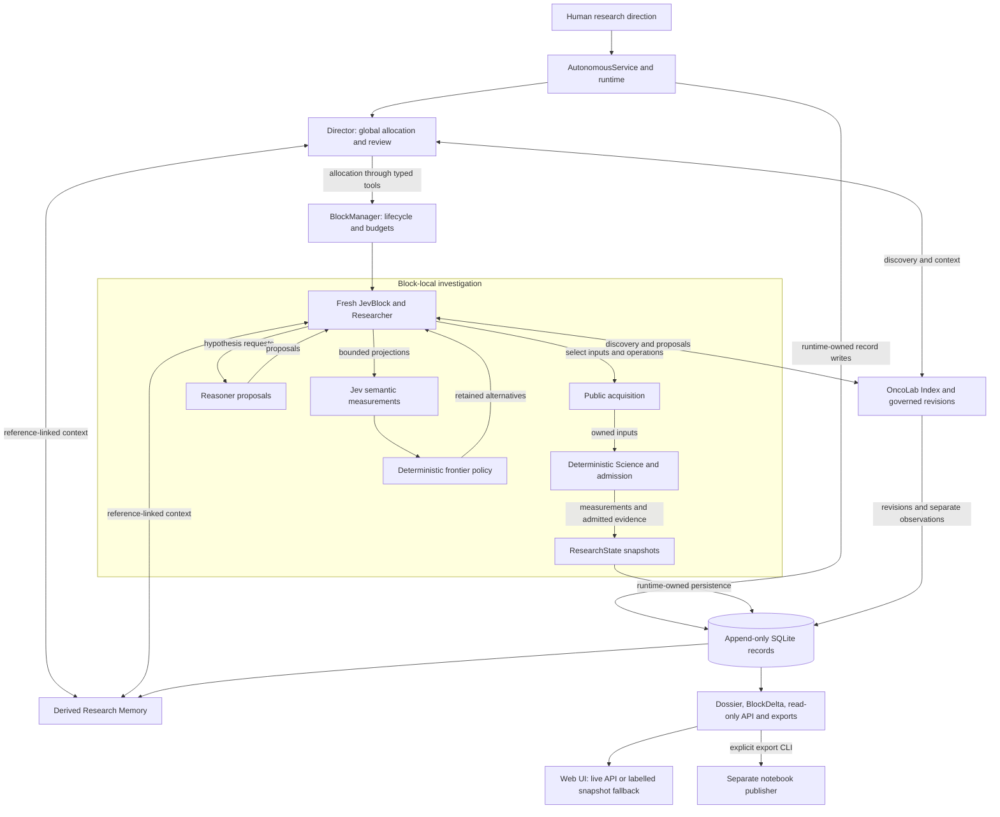
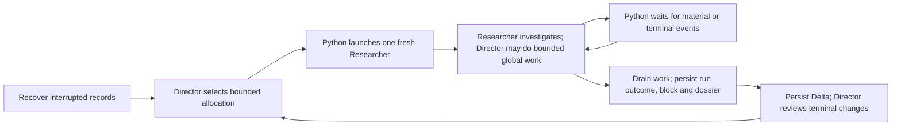

# OncoJev architecture

OncoJev turns a human research direction into bounded investigations. Python owns
lifecycle and canonical state; agents choose investigations and propose meaning.

## Components and authority flow

Arrows describe authority and data flow, not Python imports. Acquisition records,
measurements, evidence, state revisions, run receipts and institutional records
retain separate identities in the same canonical store. Derived views do not
write scientific conclusions back into those records.

## Research lifecycle

The [service](../src/autonomous.py) retains one Director instance across cycles;
each block receives a fresh Researcher, state, workspace, skills and budgets.
Continuity comes from persisted context rather than previous agent transcripts.
Python owns event waits, shared resource leases, shutdown and reconstruction.
Recovery records interruption or failure and preserves originals; it does not
resume a Researcher run. Each block permits one Researcher launch.

## Ownership boundaries

| Owner | Authority and boundary |
| --- | --- |
| [Director](../src/runtime/pydantic_ai/global_tools.py) | Chooses global allocations and reviews referenced portfolio/context. Cannot acquire local scientific inputs, run local Science, admit evidence or mutate an active block's state/deadline. |
| [Researcher and runtime](../src/runtime/pydantic_ai/contracts.py) | Researcher chooses block-local investigation through typed tools; runtime owns state updates and persistence. Researcher cannot allocate global blocks or extend its allowance. |
| [Science](../src/science/admission.py) | Produces deterministic measurements and owns explicit admission. Runtime callers resolve owned inputs and validate/replay external results before admission; execution success alone does not establish scientific validity. |
| [Jev and frontier policy](../src/runtime/pydantic_ai/semantic.py) | Jev returns typed semantic measurements on bounded projections. Deterministic policy interprets them while retaining alternatives and failures; neither grants scientific evidence authority. |
| [Reasoner](../src/runtime/pydantic_ai/reasoner.py) | Proposes hypotheses, interpretations and tests within the block allowance. Its output does not directly mutate canonical state or become evidence. |
| [OncoLab](../src/oncolab/institution.py) | Owns capability contracts, pinned revisions and separate usage/verification history. Python governance reviews proposals against scoped qualification records; discovery, metadata and route declarations do not install tools or qualify reusable execution. |
| [Memory](../src/memory/service.py) | Derives bounded, reference-linked context from records. Retrieval and semantic annotations do not admit evidence or resolve scientific uncertainty. |
| [Persistence and read models](../src/persistence/repository.py) | Store canonical records and reconstruct outcomes. Dossiers, API, UI and exports report those records; they do not decide scientific validity. Publication credentials belong to a separate downstream process. |

## Core invariants

- A successful run, block closure and scientific objective attainment are separate
  facts. `complete_block` requests handoff; successful finalization requires a
  Researcher completion receipt. Failures take precedence over contradictory
  completion, and terminal block/dossier writes are atomic and idempotent.
- Evidence admission requires deterministic source/sandbox origin, provenance,
  source references and finite top-level numeric values. Provided arrays,
  synthetic fixtures, model prose and raw scratch output cannot become evidence.
  This gate does not itself prove biological validity or resolve every reference.
- Retained inputs bind exact content and block ownership. Active blocks pin the
  registry revision, institutional history boundary and application content
  identity. New observations or revisions do not silently change their contracts.
- ResearchState uses frozen models and recorded snapshots; nested mappings are
  not deeply immutable Python objects. Runtime-owned updates append revisions;
  SQLite rejects record UPDATE/DELETE, and corrections append new records.
- Missing inputs, unknown results and operational failures are not scientific
  negatives. Soft handoff prevents new expensive work while preserving in-flight
  work. Required command controls fail closed and ownership remains held until
  work drains.

## Composition and execution

[factory.py](../src/runtime/pydantic_ai/factory.py) composes the live runtime from
[model](../config/models.yaml) and [runtime](../config/runtime.yaml) configuration.
Live mode requires provider credentials; deterministic clients are explicit
fixtures. Linux agents combine Coder and Code Mode; Windows uses Code Mode.
The Linux Coder adapter replaces only Shell and retains installed result clearing,
near-limit warnings, output truncation and argument repair. Their composition is
present; live effectiveness and native qualification require separate proof.
Coder commands and the default local-venv scientific backend use the owned Linux
command-family controls. Installed Science currently runs in worker threads under
the shared heavy-work lease, rather than that process-family governor.

The service loads local environment and validates literal `ONCOJEV_TESTING=0/1`
before storage/recovery. Config validates ordinary settings, applies only downward
block-time and public-data caps from typed `testing` YAML, then revalidates. Live
providers, role/cycle/tool budgets, scientific phases and native confinement stay
unchanged. The service freezes policy, application identity and owned paths at startup;
edits take effect on restart.

Testing uses `<configured-data-root or var>/testing/<process-uuid>/` for SQLite,
Director, Researcher and sandbox experiments. Services/cycles in one process share
the UUID; another process gets a fresh namespace. Database overrides and resolved
linked paths cannot escape it; bootstrap prepares only the base before exec.
Retention traverses that frozen workspace root and keeps its ordinary policy;
records/run roots are retained. Docker scratch receives an owned parent and keeps
its existing cleanup. Windows contract checks do not qualify Linux execution.

ServiceResources keeps shared download/disk ceilings and adds GDC/Xena data-only
response/block/service caps, including metadata and failed bytes. Local software
uses an ordinary software reservation; literature/catalogue limits stay ordinary.
Docker acquisition accounting remains its existing backend behavior; this change
does not establish Docker native/resource qualification.

Testing identity binds source/configuration content and effective runtime profile
with `application-testing-v1:`, without the random storage UUID. Existing registry
revisions, pins and receipts carry it. The local-verification consumer rejects even
complete matching testing receipts; normal identities reject them by exact matching.
Ordinary source-bound admission and retained observations/proposals remain available;
no automatic cross-store ingestion or authority transfer is added.

Normal service storage uses SQLite under its configured data root or explicit database path.
Disposable workspaces are separate from retained inputs and canonical records.
The [implementation plan](IMPLEMENTATION_PLAN.md) owns unfinished work; the
[current testing ADR](PROPOSED_ADR_FAST_LOCAL_TESTING.md) is accepted; its testing
profile is implemented through those owners with scoped local behavioral proof.
The default testing block is 90 s with handoff at 75 s; the 120 s observation target
is logged for `run_once` (excluding post-block review) and never cancels draining or
required science. Live wall time, usefulness and WSL2 qualification remain separate
explicit checks in the plan, rather than implicit blockers of ordinary code iteration.
[TASK_LOG](TASK_LOG.md) retains only the two most recent completed-task entries,
newest first; displaced entries are preserved in `docs/Archive/PREVIOUS_TASK_LOG.md`.
Other Markdown within `docs/` and retired ADRs are archived, excluded from routine
scans, and read only under the scoped exception in AGENTS. Root, source, skill,
evaluation and web READMEs retain their locations; this cleanup does not change
procedural runtime content or source provenance.

[architecture.yaml](../architecture.yaml) projects these boundaries and agent rules
for mechanical reference checks. It is not runtime policy or another authority;
ENFORCED, TESTED and REVIEWED claims retain their named proof scope.
