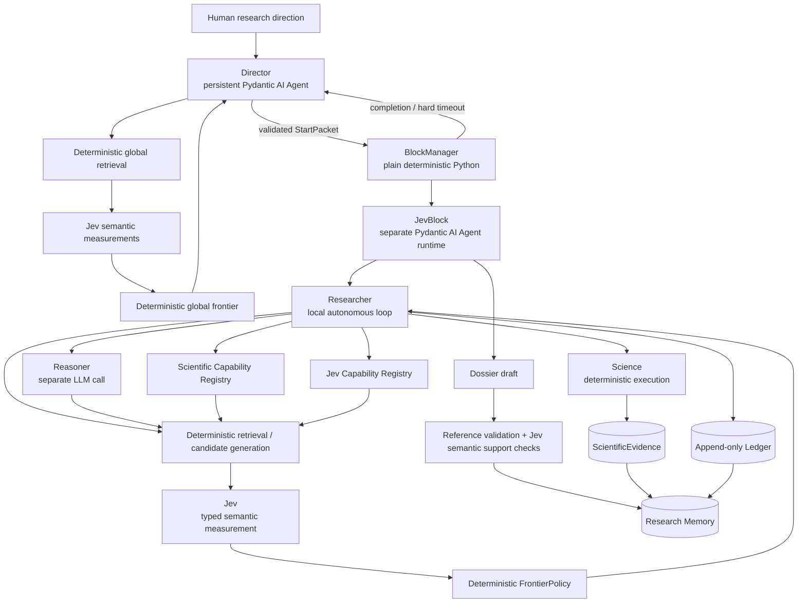

# OncoJev — Canonical Architecture and Product Specification

## Mission

Design and build OncoJev as an autonomous computational oncology research system for searching extremely large biological information spaces.

OncoJev is not a fixed cancer-analysis pipeline.

The central problem is not simply:

> How do we execute a known statistical analysis?

The harder problem is autonomously determining:

- where to search;
- which source, API, schema, entity or dataset matters;
- which information representation is sufficient;
- when richer data is worth acquiring;
- which scientific capability already exists;
- which capability needs to be constructed;
- which deterministic statistical analysis actually answers the scientific question;
- which of thousands or millions of possible candidates deserve further investigation;
- when expensive open-ended reasoning is justified;
- what hypotheses could explain an observation;
- which experiments distinguish competing explanations;
- and what deserves the next research allocation.

The primary thesis is:

> **Can high-throughput typed semantic measurement from Jev, combined with dynamically constructed deterministic scientific computation and selective deep LLM reasoning, allow an autonomous system to search very large biological information spaces for scientifically useful patterns, relationships, anomalies, hypotheses and candidate mechanisms?**

The efficiency thesis is:

> **Can OncoJev improve scientifically useful discovery per unit research allocation while preserving valuable candidate recall?**

Research allocation includes:

- wall-clock time;
- compute;
- data transfer;
- external API calls;
- expensive LLM reasoning;
- scientific analyses;
- human attention.

A human should be able to provide only a broad scientific direction.

Example:

> Investigate computational signals related to treatment resistance in lung adenocarcinoma.

The human should not have to pre-specify:

- GDC endpoint;
- data modality;
- genes;
- cohort;
- representation;
- statistical method;
- Jev questions;
- hypotheses;
- or experiment sequence.

The system should determine those during research.

---

# 1. Fundamental epistemic division

Use this as the conceptual constitution:

> **Science measures reality.**

> **Jev measures semantic properties of bounded structured states.**

> **Reasoner generates explanations, hypotheses and possibilities.**

> **Researcher chooses local research actions.**

> **Director chooses global research allocations.**

> **Deterministic Python controls lifecycle, evidence admission, composition and search-frontier policy.**

Jev is not:

- an autonomous agent;
- a scientific executor;
- the Researcher;
- the Director;
- the Reasoner;
- an evidence generator;
- an action authority.

Reasoner output is not evidence.

Researcher interpretation is not evidence.

Generated code is not evidence.

Only deterministic admitted measurements become `ScientificEvidence`.

---

# 2. Core architecture

There are only two autonomous reasoning loops:

1. Director
2. Researcher inside one JevBlock

There are no SubJevBlocks initially.

There is no specialist-agent swarm.



---

# 3. Pydantic AI is the runtime substrate

Use Pydantic AI for:

```text
Director Agent
Researcher Agent
typed dependencies
typed tools
typed outputs
model/provider integration
structured agent results
```

Do not allow Pydantic AI to define the scientific architecture.

Framework-specific concepts should remain behind a thin adapter where practical.

Conceptually:

```text
src/oncojev/runtime/pydantic_ai/
```

may contain model construction, agent construction, Code Mode integration and provider translation.

The rest of OncoJev should speak in domain types such as:

```text
JevBlockStart
AnalysisSpec
ScientificEvidence
JevQuestionSpec
JevDecision
ScientificCapability
JevCapability
LedgerEvent
JevBlockDossier
```

not framework-specific objects.

---

# 4. Director and Researcher are separate agents

The Director is one persistent Pydantic AI `Agent`.

The Researcher is another independently instantiated Pydantic AI `Agent`.

Do not model Researcher as a nested conversational child that shares the Director's context.

Use programmatic handoff:

```text
Director Agent
      ↓
validated JevBlockStart
      ↓
BlockManager
      ↓
separate Researcher Agent run
      ↓
validated JevBlockDossier
      ↓
Research Memory
      ↓
Director Agent
```

The BlockManager owns execution lifecycle.

The Director does not directly run the Researcher.

---

# 5. BlockManager

BlockManager is ordinary deterministic Python.

It owns:

```text
block ID
start time
absolute deadline
resource allocation
workspace
scientific sandbox
runtime startup
runtime cancellation
Ledger persistence
evidence persistence
termination reason
fallback Dossier construction
```

Block duration is configuration.

Example default:

```text
600 seconds
```

but 10 minutes is not architecture.

At creation:

```text
deadline = started_at + allocated_seconds
```

Persist the absolute deadline.

A running Researcher may inspect remaining time.

It may not extend its own allocation.

Changing configuration must not change an existing block's deadline.

---

# 6. Director plane

The Director asks:

> **Given everything the laboratory currently knows, what deserves the next bounded research allocation?**

Director tools operate on the research program.

Possible tools:

```text
memory.search(...)
memory.get_dossier(...)
memory.get_evidence(...)
memory.get_hypotheses(...)
memory.get_negative_results(...)
memory.get_open_uncertainties(...)

capabilities.search(...)
capabilities.describe(...)

jev_capabilities.search(...)
jev_capabilities.describe(...)

jev.evaluate(...)

block.launch(...)
block.status(...)
block.terminate(...)

director.record_decision(...)
```

The Director should not normally receive:

```text
raw source execution
GDC query execution
statistics execution
scientific Python
scientific shell
Science evidence admission
block-local generated code
```

---

# 7. Director-plane Jev

Large research memory should never be dumped into Jev or the Director.

Use:

```text
metadata / lexical / vector / entity retrieval
                  ↓
small plausible candidate set
                  ↓
Jev semantic measurements
                  ↓
deterministic global frontier
                  ↓
Director reasoning
```

Possible Jev semantic dimensions:

```text
relevance
contradiction
conceptual overlap
duplicate investigation
same unresolved uncertainty
same mechanism family
new actionability
recurring capability need
```

Examples of atomic Director-plane questions:

```text
Does this old Dossier concern substantially the same uncertainty?

Does this new result materially contradict the supplied earlier interpretation?

Are these two capability gaps manifestations of substantially the same missing capability?

Has this candidate effectively already been investigated?

Is this previously blocked hypothesis newly actionable given the supplied capability?
```

Jev changes which information becomes salient.

The Director remains the allocator.

---

# 8. StartPacket

The Director creates a typed `JevBlockStart`.

It may contain:

```text
block_id

objective
why_now

relevant_evidence_refs
relevant_dossier_refs
relevant_hypothesis_refs

known_uncertainties
known_failures

candidate_directions

suggested_scientific_capabilities
suggested_jev_capabilities

source_hints
data_hints

hard_constraints

resource_allocation
absolute_deadline
```

The Director supplies:

- a good starting position;
- relevant accumulated knowledge;
- possible useful capabilities;
- useful data/source direction;
- known failures;
- constraints.

These are priors, not an execution script.

The Director should not prescribe:

```text
call endpoint A
then use method B
then ask questions C-D-E
then call Reasoner
```

unless an actual hard protocol constraint requires it.

---

# 9. Researcher plane

The Researcher asks:

> **Given this block objective, what has already been learned, available capabilities and remaining resources, what should I do next?**

The Researcher owns local scientific strategy.

It may:

- inspect available state;
- identify the next scientific uncertainty;
- search source metadata;
- search schemas;
- search scientific capabilities;
- search Jev capabilities;
- acquire progressively richer representations;
- use Jev;
- construct an `AnalysisSpec`;
- generate local deterministic code;
- run Science;
- inspect diagnostics;
- generate candidates;
- call the Reasoner;
- generate hypotheses;
- compare hypotheses;
- test hypotheses;
- change direction;
- conclude early.

---

# 10. Canonical Researcher loop

Use this pattern whenever a large search space exists:

```text
identify scientific need
        ↓
deterministic retrieval / candidate generation
        ↓
bounded structured state
        ↓
parallel atomic Jev semantic measurements
        ↓
typed probabilities / distributions
        ↓
deterministic FrontierPolicy
        ↓
Researcher chooses next action
```

Possible actions:

```text
measure
acquire richer representation
keep alternative alive
call Reasoner
construct capability
change direction
stop
```

Never use:

```text
Researcher asks Jev what to do
↓
Jev decides action
↓
Researcher obeys
```

---

# 11. TypeSafe/Jev implementation rules

Use the supplied TypeSafe/Jev architecture dossier as the project design source.

Before implementing against the SDK, also verify the current official TypeSafe documentation and SDK.

Start from:

```text
https://docs.typesafe.ai/llms.txt
```

Discover current pages rather than relying on remembered APIs.

Only use primitives currently documented by TypeSafe.

The canonical primitives are expected to include:

```text
Noul
Choice
Score
```

but verify the current API.

---

# 12. Noul

Noul represents one Boolean semantic proposition.

Conceptually:

```text
P(proposition = true)
```

Canonical OncoJev result should preserve something equivalent to:

```text
question_id
p_true
model_requested
model_resolved
question_version
projection_id
usage/execution metadata
```

Do not manufacture a generic confidence field if the primitive itself does not supply one.

Example:

```text
Does this candidate appear materially contradicted by the supplied evidence?
```

---

# 13. Choice

Choice selects among a closed set.

Preserve:

```text
question_id
selected_option
complete option probabilities
primitive-defined confidence where applicable
model/version metadata
```

Critical rule:

> Choice always has a winner.

Therefore non-exhaustive Choice must have protection such as:

```text
NONE
OTHER
NOT_APPLICABLE
```

or a companion Noul:

```text
Does any supplied option adequately satisfy this requirement?
```

Never force-fit a scientific capability merely because it received the highest Choice probability.

---

# 14. Score

Score uses an ordered semantic rubric.

Preserve:

```text
question_id
expected_score
full level probabilities
primitive-defined confidence
question/model version
```

A Score is not a percentage.

Expected score is not enough when pruning decisions depend on uncertainty.

Preserve the complete distribution.

---

# 15. Confidence and probabilities

Never create a global assumption:

```text
confidence = probability answer is scientifically correct
```

Confidence must be interpreted per capability and empirically evaluated.

Do not define:

```text
JEV_CONFIDENCE_THRESHOLD = 0.7
```

as universal architecture.

Reusable Jev capabilities may eventually define calibrated routing policies.

---

# 16. JevQuestionSpec vs JevCapability

This distinction is mandatory.

A local semantic probe is:

```text
JevQuestionSpec
```

A validated reusable semantic operation is:

```text
JevCapability
```

Most questions remain local.

Suggested lifecycle:

```text
LOCAL
↓
CANDIDATE
↓
VALIDATED
↓
REUSABLE
```

Usage before abstraction.

A `JevQuestionSpec` may contain:

```text
question_id
semantic_purpose
primitive
state_schema
projection
instructions
criteria
option schema / score legend where applicable
known_exclusions
failure_semantics
question_version
provenance
```

A reusable `JevCapability` adds:

```text
models_evaluated
evaluation_refs
null_controls
false_negative_behavior
stability results
calibration information
version
promotion state
```

---

# 17. Structured criteria

Avoid vague semantic questions such as:

```text
Is this scientifically appropriate?
```

Prefer explicit criteria.

Example:

```yaml
criterion:
  estimand_match

definition:
  capability estimates the target quantity
  requested by the AnalysisSpec

exclude_if:
  - capability is only descriptive
  - capability estimates a materially different target
  - capability cannot represent the required design
```

Semantic prompting should be auditable.

---

# 18. Parallel questions

Parallel independent questions should be the normal Jev execution path.

Example candidate state:

```text
identity
statistical results
sample size
modalities
missingness
diagnostics
cohort properties
biological annotations
```

Possible questions asked together:

```text
unusual?
cross-modal?
trivial?
contradicted?
missingness-dominated?
worth richer investigation?
```

Do not make six serial semantic calls unless later questions genuinely depend on earlier answers.

---

# 19. Deterministic FrontierPolicy

Jev produces semantic measurements.

Python interprets them.

Introduce a first-class `FrontierPolicy`.

Conceptually:

```text
SemanticMeasurements
       ↓
FrontierPolicy
       ↓
ADVANCE
KEEP_ALIVE
ESCALATE
DEFER
REJECT_RETAIN
```

Do not silently delete candidates.

`REJECT_RETAIN` retains provenance and allows future evidence to resurface the candidate.

Do not assume one universal weighted score is appropriate.

Prefer inspectable multidimensional semantic features.

---

# 20. False-negative protection

False-negative semantic pruning is one of the most dangerous Jev failure modes.

Protect candidate recall using:

```text
multi-dimensional semantic state
complete probability preservation
beam/frontier retention
alternate semantic probes
self-consistency evaluation
richer representation escalation
Reasoner escalation
rejected-candidate audits
```

Semantic uncertainty must not silently become scientific rejection.

---

# 21. Information/source search

Use:

```text
deterministic source/schema enumeration
        ↓
Jev semantic measurement
        ↓
Researcher
```

Jev may answer:

```text
Is this field relevant to the requested scientific concept?

Could this entity represent the observation required?

Does this relationship matter to the intended cohort?

Does this description appear relevant to treatment exposure?
```

Jev may not invent endpoint existence.

Source contracts are verified deterministically.

---

# 22. Representation search

Prefer the cheapest scientifically sufficient representation.

Potential ladder:

```text
schema
metadata
counts
facets
aggregates
small records
case-level records
sample-level records
derived matrices
raw data
```

Jev should ask specific sufficiency questions:

```text
Does this representation preserve subgroup identity?

Does it preserve temporal ordering?

Does aggregation remove required pairing?

Can it represent the required exposure/outcome relationship?

Could omitted information materially change the next decision?
```

Python decides whether to escalate.

---

# 23. Scientific Capability Registry

Scientific capabilities execute deterministic work.

Examples:

```text
gdc.search_cases
cohort.construct
transform.normalize
statistics.fisher_exact
statistics.logistic_regression
statistics.cox
multiple_testing.adjust
```

Categories may include:

```text
sources/
cohorts/
transforms/
quality-control/
statistics/
analyses/
ngs/
external/gdan/
```

Capability contracts should include:

```text
capability_id
purpose
input contract
output contract
applicability
assumptions
limitations
missingness semantics
implementation reference
provenance
validation state
resource expectations
version
```

---

# 24. Jev at Scientific Capability search

Use:

```text
scientific need
       ↓
deterministic capability retrieval
       ↓
candidate capability set
       ↓
parallel atomic Jev measurements
       ↓
FrontierPolicy
       ↓
Researcher selection
```

Possible questions:

```text
Does this method estimate the requested quantity?

Are the required variables available?

Can it accommodate the named covariate?

Does its applicability include this study design?

Is a documented limitation active?

Does its missingness behaviour preserve the required semantics?
```

Jev does not execute the capability.

Science executes.

---

# 25. Statistics and AnalysisSpec

Statistical methods belong in the Scientific Capability Registry.

Examples:

```text
Fisher exact
chi-square
logistic regression
linear models
Cox
Kaplan-Meier
permutation methods
bootstrap
correlation
stratified methods
multiple-testing procedures
```

Distinguish:

```text
StatisticalMethod
```

from:

```text
AnalysisSpec
```

An `AnalysisSpec` combines:

```text
scientific question
population
variables
estimand
transformations
method
covariates
missingness policy
diagnostics
outputs
```

Most `AnalysisSpec`s remain local.

Repeated patterns may later earn reusable capability status.

---

# 26. Jev at method selection

Do not ask:

> Which statistic should I use?

Instead provide typed analysis state and evaluate candidate methods with independent questions.

Examples:

```text
Does method M estimate the requested estimand?

Are its variable requirements satisfied?

Can it accommodate the named covariates?

Does it require independence contradicted by the supplied design?

Does it require time-to-event information?

Does it answer association when the requested quantity is enrichment?
```

Python composes the results.

Researcher chooses/specifies the analysis.

Science computes the statistic.

---

# 27. Science

Science owns deterministic scientific execution:

```text
source calls
parsing
cohort construction
transformations
statistical computation
diagnostics
generated deterministic analysis code
reproducible measurements
ScientificEvidence admission
```

Deterministic does not mean predetermined.

The Researcher may dynamically write an analysis.

Canonical path:

```text
AnalysisSpec
    ↓
deterministic execution
    ↓
MeasuredResult
    ↓
validation
    ↓
ScientificEvidence
```

---

# 28. Candidate discovery

Science may generate large candidate sets such as:

```text
gene × phenotype
alteration × outcome
mutation × expression
CNV × expression
pathway × phenotype
rare co-occurrences
cross-modal discordances
subgroup enrichments
unexpected absences
```

Canonical search:

```text
large raw candidate space
        ↓
deterministic validity filters
        ↓
high-recall deterministic ranking
        ↓
manageable candidate frontier
        ↓
parallel Jev semantic measurements
        ↓
deterministic FrontierPolicy
        ↓
Researcher
        ↓
selective Reasoner
```

Keep semantic dimensions separate where useful:

```text
unusual
cross_modal_support
trivial_explanation
missingness_artifact
material_contradiction
worth_deeper_investigation
```

---

# 29. Search distributions and beam retention

Choice probabilities may represent exploration pressure rather than merely selecting one winner.

Example:

```text
branch A 0.48
branch B 0.39
branch C 0.08
branch D 0.05
```

A reasonable frontier may preserve A and B.

This applies to:

```text
source branches
schema branches
capability families
method families
mechanism families
hypothesis clusters
```

Use beam/frontier preservation when ambiguity matters.

---

# 30. Reasoner

Reasoner is not another autonomous agent.

It is a separate configurable LLM capability invoked by the Researcher.

Use Reasoner for:

```text
open-ended scientific interpretation
mechanism generation
alternative explanations
difficult methodological reasoning
diverse hypothesis generation
proposed discriminating tests
```

Reasoner output is not evidence.

---

# 31. Minimal hypothesis / research-continuation behavior

Apply the following specifically to hypothesis exploration and candidate next investigations.

Do not turn every Researcher action into a tournament.

The behavior is:

> **Generate multiple hypotheses or plausible next investigations, compare them against what has already been learned, pursue the most useful unexplored one, and escalate only when the research requires a new scope.**

Canonical sequence:

```text
Researcher generates several plausible hypotheses
or next investigations
        ↓
deterministic retrieval of relevant prior learning
        ↓
Jev compares bounded semantic properties
        ↓
Python filters invalid / redundant /
unsupported / out-of-scope options
        ↓
Researcher selects the best continuation
within the current block
```

Jev dimensions may include:

```text
novelty
relevance
coherence
overlap / redundancy
consistency with evidence
whether it resolves a meaningful uncertainty
whether it is testable
whether it stays within scope
```

The principle is:

> **Researcher expands within scope.**

> **Researcher proposes beyond scope.**

> **Director allocates new scope.**

If the most useful next investigation substantially exceeds the current objective, the Researcher does not silently broaden the block.

It records the proposed continuation for the Director.

---

# 32. Hypothesis handling

Never ask Jev:

```text
Is hypothesis H true?
```

Jev may measure:

```text
consistency with evidence
material contradiction
explanatory relevance
specificity
falsifiability
testability
discriminating prediction
redundancy
unsupported assumption burden
```

Reasoner generates possibilities.

Jev measures bounded semantic properties.

Python manages the frontier.

Researcher chooses what to investigate.

Science tests it.

---

# 33. Hypothesis deduplication

Reasoner-generated diversity may contain paraphrases.

Use deterministic retrieval + Jev semantic alignment to identify:

```text
substantial overlap
redundancy
contradiction
distinct mechanism
```

Then Python clusters or filters.

Preserve genuinely distinct plausible alternatives.

---

# 34. Experiment/test search

Jev may measure:

```text
Does test T distinguish H1 from H2?

Is T redundant with work already performed?

Does T require unavailable information?

Does T actually measure the intended distinction?

Could T materially resolve the current uncertainty?
```

Researcher selects.

Science executes.

---

# 35. Code Mode

Use Pydantic AI Code Mode selectively for bounded programmatic orchestration when it materially reduces agent round trips.

Useful cases:

```text
loop over retrieved candidates
batch API calls
batch Jev evaluations
parallel bounded tools
filter/aggregate intermediate results
```

Do not treat Code Mode as the scientific execution substrate.

Full scientific computation requiring:

```text
NumPy
pandas
SciPy
statsmodels
bioinformatics tools
arbitrary scientific packages
```

belongs to the Science sandbox/runtime.

---

# 36. Scientific sandbox

Each JevBlock may have an isolated scientific workspace/sandbox.

It belongs to the block.

It is not another agent.

Use it for:

```text
Python
shell
temporary files
generated analysis code
scientific packages
tests
intermediate data
```

Scientific outputs enter evidence only through deterministic Science admission.

---

# 37. Ledger

Every block has an append-only Ledger.

Automatically record significant operations.

Possible event types:

```text
ToolCall
ToolResult
SourceCall
ScienceExecution
JevExecution
ReasonerCall
CapabilitySearch
CapabilityUse
CapabilityCreated
CapabilityFailure
EvidenceAdmission
FrontierDecision
ResearcherNote
ResourceUsage
Error
```

The Researcher can query its own Ledger.

It cannot rewrite history.

Possible queries:

```text
ledger.recent
ledger.search
ledger.failures
ledger.capabilities_used
ledger.resource_usage
ledger.evidence_created
```

---

# 38. Jev execution telemetry

Each Jev execution should retain enough information to evaluate behaviour later.

Capture:

```text
call_id
block_id

model_requested
model_resolved

question_ids
question_versions
primitive types

state projection ID/version

typed answers
complete probability distributions
primitive-native confidence where applicable

duration
retries
failure category

related capabilities
FrontierPolicy result
```

Operational telemetry is not ScientificEvidence.

---

# 39. Jev failure semantics

Hard invariant:

> **Jev execution failure != negative semantic judgment.**

Examples:

```text
timeout
rate limit
transport failure
invalid request
SDK validation failure
model service failure
```

must remain operational failures.

Likewise:

```text
source failure != biological absence

missing != zero
```

---

# 40. Model pinning and evaluation

Reusable Jev capabilities should record the model/version against which they were evaluated.

If a model version changes:

```text
replay evaluation corpus
↓
compare calibration/stability
↓
check false-negative behaviour
↓
revalidate routing policy
↓
promote new version if justified
```

Moving aliases must not silently alter scientific policy.

---

# 41. Jev Capability evaluation

Evaluate important reusable semantic capabilities for:

```text
false-negative rate
false-positive rate
candidate recall
precision where relevant
calibration
stability
threshold sensitivity
irrelevant-context sensitivity
prompt-form sensitivity
model-version drift
downstream search utility
```

At minimum test:

```text
identical state repeated
irrelevant-field perturbation
semantically equivalent reformulation
null controls
false-negative-sensitive examples
```

Repeatability is not correctness.

---

# 42. Jev Capability Registry

Keep the registry small.

Potential categories:

```text
memory/
information/
representation/
capability/
method/
candidate/
hypothesis/
experiment/
dossier/
```

Scientific Capability:

```text
executes deterministic work
```

Jev Capability:

```text
measures a reusable semantic property
```

Skill:

```text
teaches the Researcher how or when to approach something
```

These are different concepts.

---

# 43. Dossier

At block completion, generate a typed Dossier.

Include:

```text
block_id
objective
termination_reason

ScientificEvidence refs

positive findings
important negative findings
candidate findings

hypotheses
plausible alternatives
weakened hypotheses
contradicted hypotheses
redundant hypotheses

unresolved uncertainties

important Jev measurements
FrontierPolicy decisions

analyses performed

Scientific Capabilities used
local Scientific Capabilities created
Scientific Capability gaps

Jev Capabilities used
local JevQuestionSpecs worth evaluating
Jev Capability gaps

resource usage

recommended_next_blocks
preferred_continuation
preferred_continuation_reason
```

At completion, the human-readable summary should support:

```text
CURRENT BLOCK COMPLETE

Recommended next blocks:
1. ...
2. ...
3. ...

Preferred continuation:
...

Reason:
the most important unresolved uncertainty created by the current evidence.
```

These are recommendations.

The Researcher may not allocate the next block.

---

# 44. Dossier validation

Before the final Dossier enters Research Memory:

```text
draft Dossier
      ↓
deterministic evidence-reference/provenance validation
      ↓
Jev bounded semantic support checks
      ↓
typed final Dossier
```

Possible Jev checks:

```text
Does the referenced evidence semantically support this statement?

Does this statement overstate association as causation?

Does it generalize beyond the measured cohort?

Does it treat speculation as observation?

Does it convert source failure into biological absence?
```

Dossier validation does not create ScientificEvidence.

Preserve epistemic labels such as:

```text
MEASURED
INTERPRETED
HYPOTHESIZED
CONTRADICTED
UNRESOLVED
NEGATIVE_RESULT
```

---

# 45. Capability evolution

When a scientific capability is missing:

```text
need
↓
registry retrieval
↓
Jev compatibility measurements
↓
nothing adequate
↓
Researcher builds local capability
↓
deterministic tests
↓
Science uses it
↓
Ledger/Dossier records it
```

Across blocks:

```text
repeated capability gaps / repeated local implementations
        ↓
deterministic retrieval
        ↓
Director-plane Jev alignment
        ↓
Director identifies recurring capability family
        ↓
capability-focused JevBlock
        ↓
generalize
        ↓
validate
        ↓
possible reusable capability
```

The Director detects the need.

A Researcher builds it.

Deterministic governance promotes it.

No capability self-promotes.

---

# 46. GDC bootstrap

Use GDC as the first major scientific information space, not as OncoJev's architecture.

Potential upstream references:

```text
NCI-GDC/gdcdictionary
NCI-GDC/gdcdatamodel2
NCI-GDC/gdc-models
NCI-GDC/gdc-workflow-overview
NCI-GDC/gdc-docs
NCI-GDC/gdc-client
```

Bootstrap discoverable knowledge about:

```text
entities
properties
relationships
indices
source/API operations
representations
harmonized outputs
provenance
transfer mechanisms
```

Do not hardcode mutation/expression/CNV as the core architecture.

---

# 47. GDAN

Treat GDAN as a source of candidate scientific methods and executable capabilities.

Upstream method code is not automatically trusted.

A GDAN method becomes an OncoJev Scientific Capability only after:

```text
explicit wrapper
input/output contract
applicability definition
deterministic execution
provenance
validation
```

---

# 48. NGS/OpenAI skills

Use relevant OpenAI NGS material as source/reference and procedural guidance.

Adapt useful knowledge into:

```text
skills/ngs/
```

A skill teaches.

An executable workflow belongs under:

```text
Scientific Capability Registry
```

only after validation.

---

# 49. Model/provider configuration

Director, Researcher and Reasoner are independently configurable.

Use:

```text
config/models.yaml
```

Conceptually:

```yaml
director:
  provider: openrouter
  model: ...
  reasoning:
    effort: high
  max_output_tokens: ...
  timeout_seconds: ...
  fallbacks: []

researcher:
  provider: openrouter
  model: ...
  reasoning:
    effort: medium
  max_output_tokens: ...
  timeout_seconds: ...
  fallbacks: []

reasoner:
  provider: openrouter
  model: ...
  reasoning:
    effort: high
  max_output_tokens: ...
  timeout_seconds: ...
  fallbacks: []

jev:
  provider: typesafe
  model: ...
```

Provider adapters translate reasoning settings.

Do not assume every provider supports the same effort names or reasoning budgets.

Secrets belong in `.env`.

Model policy belongs in version-controlled configuration.

---

# 50. Runtime configuration

Use:

```text
config/runtime.yaml
```

Configurable policies may include:

```text
block duration
handoff reserve

maximum tool calls
maximum Jev calls
maximum Reasoner calls
maximum source calls
maximum downloaded bytes
maximum block cost
maximum concurrent blocks

timeouts
retries

Director retrieval breadth
Director semantic frontier size
Scientific Capability search breadth
Jev Capability search breadth

sandbox configuration

feature flags
```

Policies are configurable.

Epistemic invariants are not.

---

# 51. Hard invariants

The following are architecture/test invariants:

```text
JevDecision != ScientificEvidence

ReasonerOutput != ScientificEvidence

Researcher reasoning != ScientificEvidence

generated code != ScientificEvidence

Dossier != ScientificEvidence

only deterministic Science admission creates ScientificEvidence

Jev execution failure != negative semantic judgment

source failure != biological absence

missing != zero

semantic uncertainty != scientific rejection

Choice winner != proof of suitability

Score != probability

confidence != empirical correctness probability

local JevQuestionSpec != reusable JevCapability

local ScientificCapability != reusable ScientificCapability

capability cannot self-promote

Researcher owns local investigation

Director owns global allocation

BlockManager owns lifecycle/deadlines

Ledger is append-only
```

---

# 52. `.upstream` safeguard

`.upstream/` may exceed 1 GB.

It must never be part of normal repository comprehension.

Repository understanding order:

```text
AGENTS.md
README.md
relevant docs/
config/
src/
registries/
skills/
tests/
web/ if relevant
```

Do not recursively:

```text
read
grep
index
summarize
lint
typecheck
test
```

`.upstream/`.

Only after a specific implementation/scientific question exists:

```text
read .upstream/manifest.yaml
↓
identify exact upstream repo
↓
identify smallest relevant file/path
↓
inspect only that material
↓
answer the concrete question
↓
stop
```

Upstream is late verification/reference material.

---

# 53. Harness-engineering principles

Optimize the repository for agent legibility.

Use:

> **Give the agent a map, not a thousand-page manual.**

`AGENTS.md` should be a short navigation and durable-rules document.

Repository-native docs, code, tests, schemas and configuration are the system of record.

Use progressive disclosure.

Make important architectural boundaries mechanically testable.

If Codex repeatedly fails at something, ask:

> What capability, feedback loop, observable state or enforceable constraint is missing?

Prefer fixing the environment/harness over adding increasingly large instructions.

Expose to coding agents:

```text
tests
logs
API schemas
configuration
frontend state
observability
clear scripts
repeatable local commands
```

Keep docs current and remove obsolete architecture.

---

# 54. Final operating principle

The final conceptual model is:

> **Science measures reality.**

> **Jev measures semantics at scale.**

> **Reasoner generates possibilities.**

> **Researcher decides how to investigate.**

> **Director decides what deserves investigation.**

> **Python controls lifecycle, evidence and the search frontier.**

The core evaluation question is:

> **Does high-throughput typed semantic measurement allow OncoJev to reduce enormous biological search spaces while preserving valuable recall and improving scientifically useful discovery per research allocation?**