# OncoJev × TypeSafe/Jev

## Canonical Architecture and Capability Dossier

## 1. Executive conclusion

TypeSafe/Jev fits OncoJev unusually well, but only if its role is kept narrow.

The key architectural insight is:

> **Jev is a typed semantic measurement layer between deterministic candidate generation and agentic action selection.**

Jev is not another autonomous agent.

Jev is not a scientific executor.

Jev is not a replacement for the Researcher.

Jev is not a replacement for the Reasoner.

Jev is not allowed to convert semantic judgement into ScientificEvidence.

The resulting epistemic division should be:

> **Science measures the world.**\
> **Jev measures semantic properties of bounded states.**\
> **Reasoner generates explanations, hypotheses and possibilities.**\
> **Researcher chooses local research actions.**\
> **Director chooses global research allocations.**\
> **Deterministic code enforces policy, lifecycle, evidence admission and search-frontier management.**

This is stronger and more precise than the earlier shorthand:

> Jev judges. Python decides.

The canonical runtime therefore becomes:

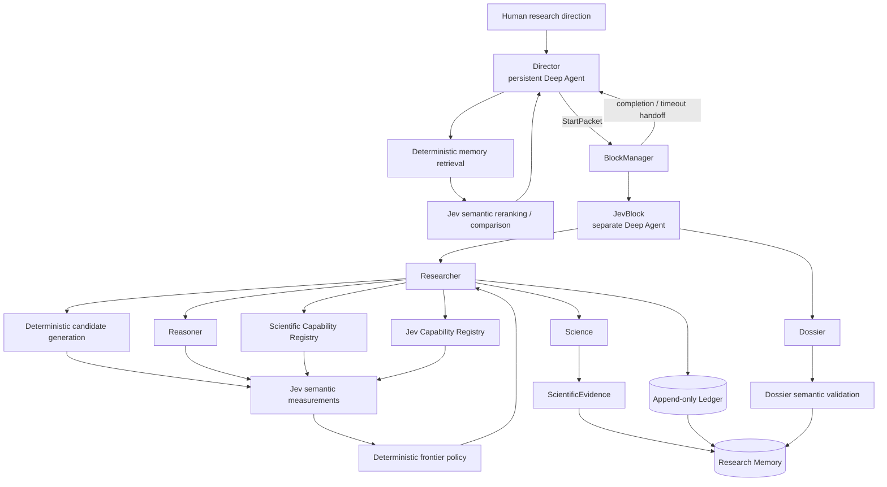

The central Jev execution pattern should almost always be:

```text
deterministic candidate generation
        ↓
bounded structured state
        ↓
parallel atomic Jev measurements
        ↓
typed probabilities / distributions
        ↓
deterministic composition
        ↓
preserve / escalate / prune / broaden
        ↓
Researcher or Director chooses next action
```

Not:

```text
Agent asks Jev what to do
↓
Jev decides
↓
Agent executes
```

That distinction should become part of the architecture constitution.

---

# 2. The three intelligence regimes

OncoJev has three fundamentally different computational regimes.

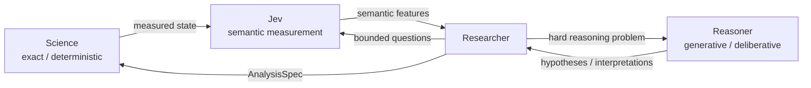

## Science

Science answers questions such as:

```text
How many cases satisfy this filter?
What is the p-value?
What is the estimated hazard ratio?
Does this JSON conform to the schema?
Which samples contain this alteration?
What is the bootstrap confidence interval?
```

Science owns:

- source calls;
- parsing;
- cohort construction;
- transformations;
- statistical calculations;
- diagnostics;
- generated deterministic code;
- reproducible measurements;
- ScientificEvidence admission.

Science may be dynamically constructed.

Deterministic does not mean predetermined.

A Researcher can generate a new analysis specification or new executable code, but the result only becomes evidence through deterministic execution and validation.

---

## Jev

Jev answers questions such as:

```text
Is this capability semantically compatible with the requested estimand?

Does this representation preserve the distinction needed by the next decision?

Does this historical Dossier appear materially relevant to this new finding?

Are these two hypotheses substantially redundant?

Does this candidate appear dominated by missingness?

Does this evidence semantically support the Dossier statement?
```

Jev owns semantic measurement.

Its native outputs should be retained rather than collapsed prematurely.

---

## Reasoner

Reasoner answers questions such as:

```text
What mechanisms could explain this pattern?

Generate genuinely different competing hypotheses.

What alternative explanations should be considered?

What experiment could discriminate H1 from H2?

How might this statistical anomaly connect to known biology?
```

Reasoner owns open-ended generation and deliberation.

Reasoner output is not evidence.

---

# 3. TypeSafe primitives

There are three core semantic primitives.

No additional primitive should be invented inside OncoJev unless TypeSafe itself introduces one.

## Noul

Noul asks one Boolean proposition.

Conceptually:

```text
P(proposition = true)
```

Examples:

```text
Is this candidate materially contradicted by the supplied evidence?

Does this capability support adjustment for the specified covariate?

Does this historical Dossier concern substantially the same phenomenon?
```

Important:

A Noul output is already probabilistic.

Do not manufacture an extra generic `confidence` field.

Canonical internal representation:

```text
NoulDecision
    question_id
    p_true
    model
    question_version
    usage metadata
    execution metadata
```

---

# 4. Choice

Choice selects among a closed set of alternatives.

Canonical representation:

```text
ChoiceDecision
    question_id
    selected_option
    probabilities
    confidence
    model
    question_version
```

Choice is appropriate for:

```text
Which schema branch?
Which capability family?
Which representation class?
Which broad mechanism class?
Which hypothesis cluster?
```

Choice has a fundamental failure mode:

> it always has a winner.

Therefore any non-exhaustive Choice should be paired with one of:

```text
NONE
OTHER
NOT_APPLICABLE
```

or a companion Noul such as:

```text
Does any supplied capability adequately satisfy the requirement?
```

This pattern is critical for OncoJev.

Otherwise the system will force-fit inappropriate scientific capabilities.

---

# 5. Score

Score represents an ordered semantic rubric.

Canonical representation:

```text
ScoreDecision
    question_id
    expected_score
    level_probabilities
    confidence
    model
    question_version
```

A Score is not a percentage.

A fractional Score is the expected value over the ordered levels.

For example:

```text
0 = clearly incompatible
1 = major incompatibility
2 = partially compatible
3 = compatible with qualifications
4 = directly compatible
```

Two identical expected scores may have very different probability distributions.

Therefore OncoJev should retain complete distributions whenever the result affects search or pruning.

---

# 6. JevQuestionSpec versus JevCapability

This distinction is essential.

Do not turn every semantic question into a reusable capability.

That would reproduce the abstraction explosion that earlier OntoJev iterations suffered from.

Use:

```text
JevQuestionSpec
```

for a local semantic probe.

Use:

```text
JevCapability
```

only for a repeatedly useful, evaluated semantic operation.

Lifecycle:

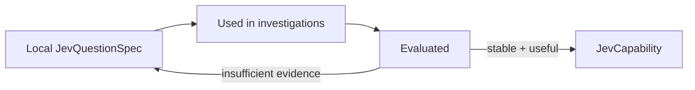

Suggested status lifecycle:

```text
LOCAL
CANDIDATE
VALIDATED
REUSABLE
```

Most questions should remain `LOCAL`.

Usage before abstraction.

---

# 7. JevQuestionSpec contract

A useful local question contract should eventually contain:

```text
question_id
semantic_purpose
primitive

state_schema

instructions

criteria_schema
option_schema
score_legend

known_exclusions

failure_semantics

question_version
provenance
```

The important addition from the TypeSafe documentation is structured criteria.

Do not rely only on prose such as:

```text
Is this scientifically appropriate?
```

Prefer something explicit:

```yaml
criterion:
  estimand_match

definition:
  capability estimates the target quantity
  requested by the AnalysisSpec

exclude_if:
  - capability is only descriptive
  - capability estimates a different target
  - capability cannot represent the required design
```

This turns semantic prompting into an auditable contract.

---

# 8. JevCapability contract

Reusable semantic capabilities can extend that contract:

```text
jev_capability_id

semantic_purpose
primitive

required_state
projection

instructions
criteria

known_exclusions
failure_semantics

confidence_interpretation

models_evaluated
evaluation_refs

null_controls
false_negative_behavior

status
version
provenance
```

The registry should remain deliberately small.

---

# 9. Director-plane Jev

Director Jev should operate on retrieved global memory, not global memory itself.

The correct architecture is:


Not:

```text
Research Memory
↓
dump everything into Jev
```

The Director may ask:

```text
Is this old Dossier relevant to the current uncertainty?

Does this result materially contradict an older interpretation?

Are these two candidate mechanisms substantially overlapping?

Has this candidate effectively already been investigated?

Is this previously blocked hypothesis newly actionable?

Are these repeated capability gaps manifestations of the same missing capability?
```

This maps directly onto several TypeSafe cookbook patterns:

- reranking;
- RAG passage classification;
- entity alignment;
- hierarchical classification;
- skill suggestion.

The Director remains the allocator.

Jev merely changes what information becomes salient.

---

# 10. Research Memory search

Suppose OncoJev eventually contains:

```text
80,000 Dossiers
250,000 ScientificEvidence objects
50,000 hypotheses
30,000 negative findings
20,000 capability-gap records
```

Do not semantically evaluate all of them.

Use:

```text
metadata filters
+
lexical retrieval
+
vector retrieval
+
entity indices
+
temporal constraints
```

to produce perhaps:

```text
20–100 plausible records
```

Then ask Jev semantic questions across that candidate set.

Possible semantic dimensions:

```text
relevance
contradiction
conceptual overlap
new actionability
same mechanism
same unresolved uncertainty
```

Then deterministic frontier policy keeps the appropriate subset.

---

# 11. Scientific Capability search

The TypeSafe skill-suggestion cookbook is almost a direct blueprint.

Use:

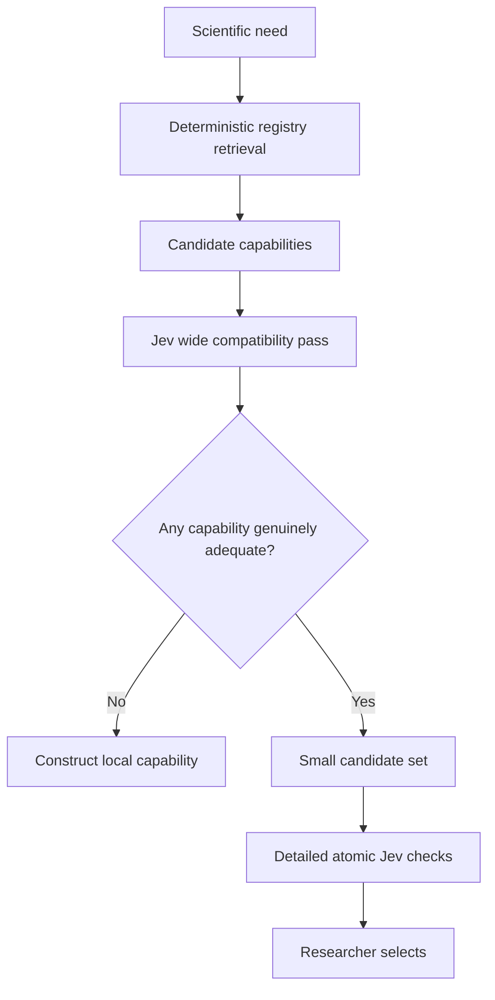

Possible atomic questions:

```text
Does this method estimate the requested quantity?

Are its required variables available?

Can it accommodate the specified covariate?

Does its applicability include this study design?

Is a documented limitation active in this case?

Does its missingness behaviour preserve the required semantics?
```

Jev does not execute the capability.

The Researcher selects.

Science executes.

---

# 12. Statistical-method selection

This is one of the strongest TypeSafe fits.

Bad pattern:

```text
Which statistic should I use?

Choice:
- Fisher exact
- chi-square
- logistic regression
- Cox
- permutation
```

Better architecture:

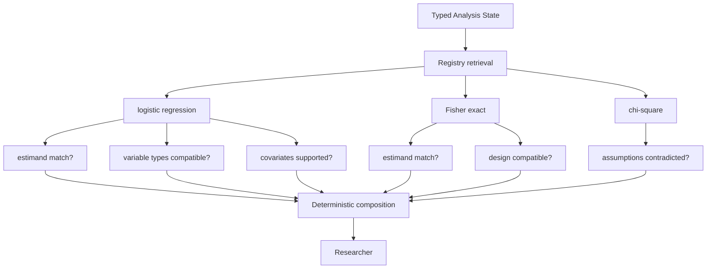

The important TypeSafe pattern is:

> shared structured state + many independent atomic questions.

This should become one of the primary OncoJev Jev idioms.

---

# 13. Representation selection

OncoJev should prefer the cheapest scientifically sufficient representation.

Possible ladder:

```text
schema
metadata
counts
facets
aggregates
small records
case-level records
sample-level records
derived matrices
raw data
```

Use Jev to evaluate specific semantic sufficiency conditions.

Not:

```text
Is this representation good enough?
```

Instead:

```text
Does this representation preserve subgroup identity?

Does it retain temporal ordering?

Does aggregation remove sample-level pairing?

Can it represent the required exposure/outcome relationship?

Could omitted information materially alter the next scientific decision?
```

Then deterministic policy decides whether to escalate.

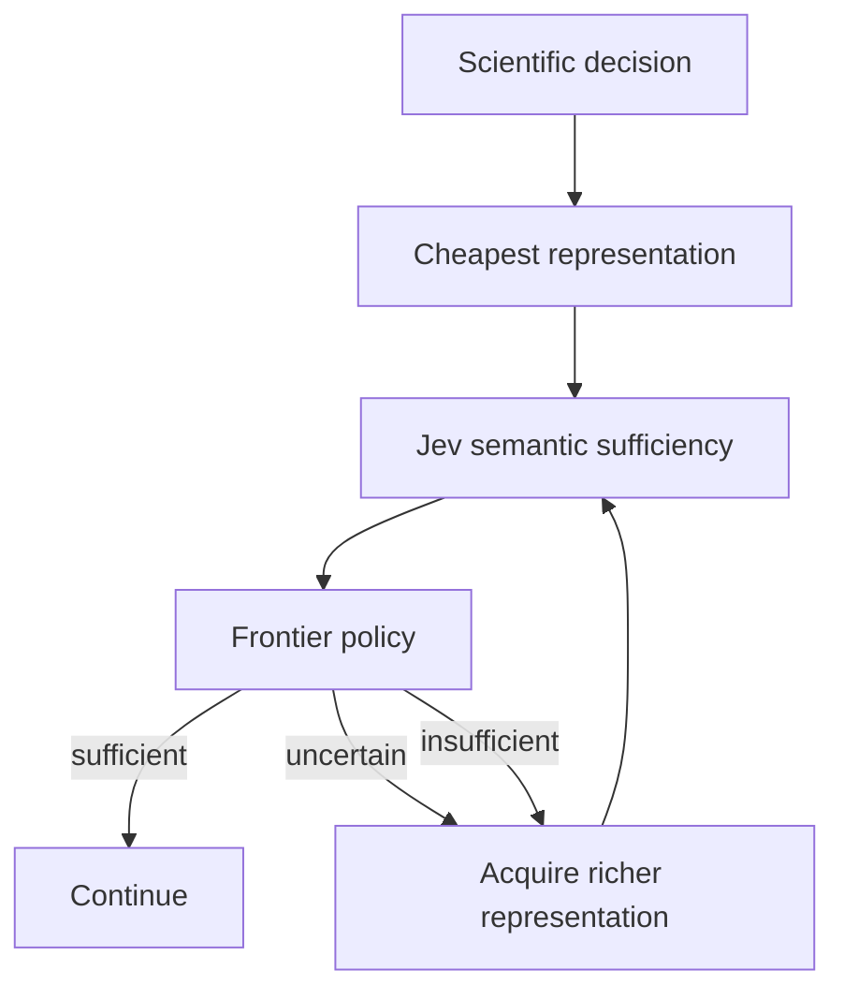

This maps directly onto confidence routing and cascades.

---

# 14. Candidate discovery

This is probably the most important Jev use inside OncoJev.

Science may produce extremely large candidate spaces:

```text
gene × phenotype
alteration × outcome
mutation × expression
CNV × expression
pathway × phenotype
cross-modal discordances
rare co-occurrences
subgroup enrichments
unexpected absences
```

The architecture should resemble:

```text
18,420 candidates

↓ deterministic validity filters

2,000 statistically plausible

↓ deterministic high-recall ranking

250 candidates

↓ Jev semantic measurement

unusual?
non-trivial?
cross-modal?
contradicted?
missingness-dominated?
biologically tautological?
worth richer analysis?

↓ deterministic frontier policy

20–40 live candidates

↓ Researcher

↓ selective Reasoner

3–10 candidates receive expensive interpretation
```

Do not compress these semantic properties immediately into one opaque number.

Keep:

```text
novel_or_unusual
cross_modal_support
trivial_explanation
missingness_artifact
material_contradiction
worth_deeper_investigation
```

as separate semantic features.

This gives OncoJev inspectable search behaviour.

---

# 15. Jev as search distribution

Choice probabilities should not merely produce a winner.

They can maintain a search frontier.

Suppose:

```text
source_A 0.48
source_B 0.39
source_C 0.08
source_D 0.05
```

A greedy system chooses only A.

OncoJev should frequently preserve A and B.

This idea generalises to:

```text
source branches
schema branches
mechanism families
method families
capability families
hypothesis clusters
```

Canonical pattern:

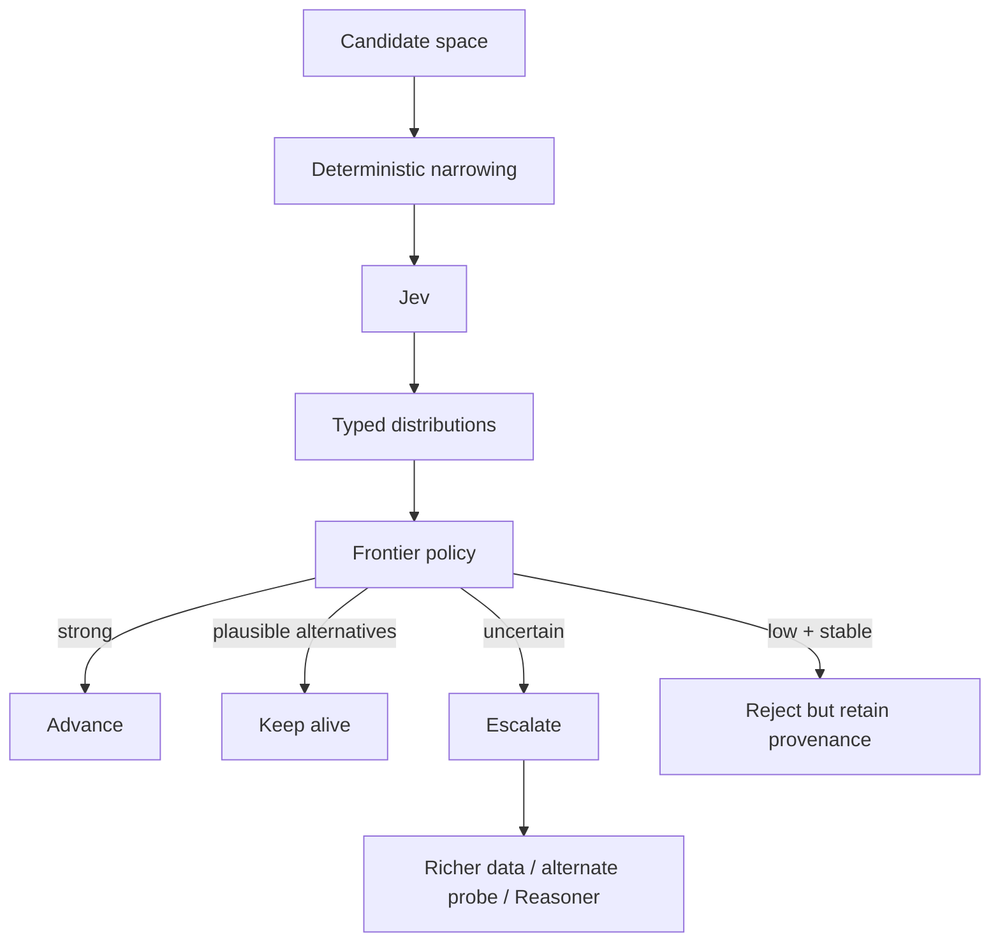

This is one of the most important consequences of the TypeSafe hierarchical-classification cookbook.

Jev outputs can represent exploration pressure.

Not merely classification.

---

# 16. Hierarchical semantic search

Large taxonomies should not be flattened into enormous Choice calls.

For GDC and later biological information spaces, use hierarchy.

Example:

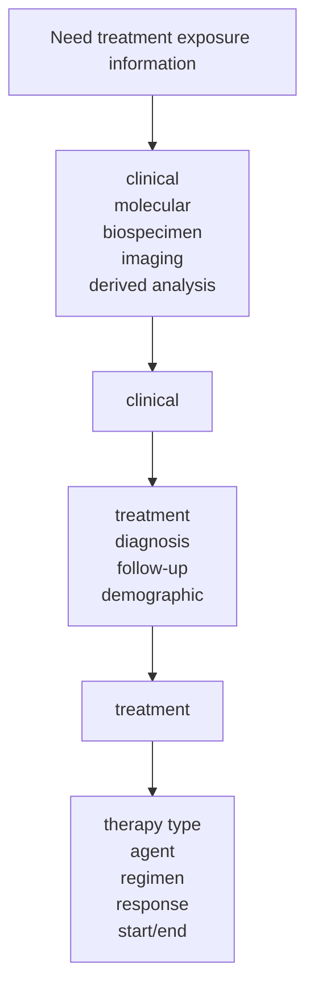

Do not necessarily follow only one branch.

Use a small beam when probabilities are close.

This applies to:

- GDC schema exploration;
- capability registries;
- ontologies;
- method families;
- research-memory taxonomies;
- mechanism families.

---

# 17. Semantic line-by-line search

The line-search cookbook is highly relevant to OncoJev's context discipline.

It should become a targeted semantic inspection capability.

Use:

```text
identify exact relevant document deterministically
↓
split into bounded sections / clauses
↓
semantic Choice over section IDs
+
Noul: does this document actually contain the answer?
↓
read only top relevant sections
```

This is particularly suitable for `.upstream`.

Canonical flow:

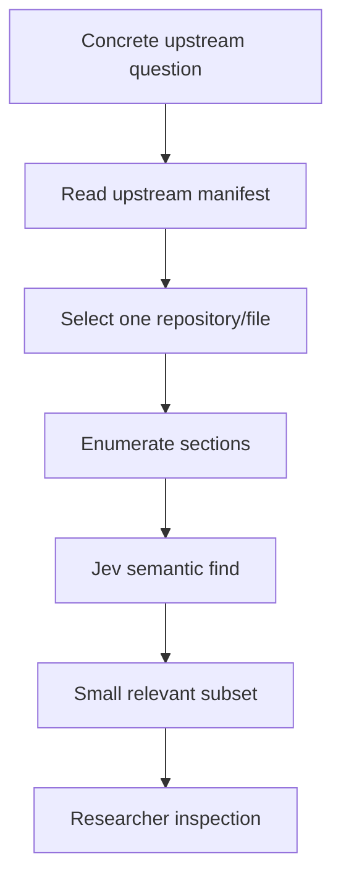

Possible uses:

- Deep Agents source/docs;
- GDC dictionary/schema files;
- GDAN method descriptions;
- NGS procedural material;
- capability documentation;
- long scientific reports;
- old Dossiers.

This does not replace deterministic search.

It comes after deterministic narrowing.

---

# 18. Hypothesis management

Jev should never answer:

```text
Is hypothesis H true?
```

Instead it evaluates bounded properties.

Examples:

```text
Is H consistent with the supplied evidence?

Is H materially contradicted by observation E?

Does H explain the focal observation?

Is H sufficiently specific?

Is H falsifiable?

Is H testable with available information?

Does H make a discriminating prediction?

Does H substantially overlap another hypothesis?

Does H require unsupported assumptions?
```

This is semantic measurement.

Not scientific truth.

---

# 19. Hypothesis alignment

Entity alignment maps naturally onto hypothesis deduplication.

Reasoner might generate:

```text
H1: KEAP1 loss promotes resistance through oxidative-stress adaptation.

H2: NRF2 activation enables survival under treatment-induced oxidative stress.

H3: KEAP1/NRF2 pathway activation produces a resistant redox state.
```

Before treating these as three independent hypotheses:

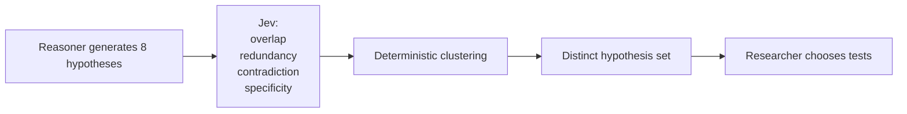

This guards against superficial diversity caused by paraphrasing.

---

# 20. Experiment/test search

The same approach applies to proposed tests.

Jev may ask:

```text
Does this test distinguish H1 from H2?

Is this test redundant with one already performed?

Does it require unavailable information?

Does it measure the intended distinction?

Could it materially resolve the uncertainty?
```

Researcher chooses.

Science executes.

---

# 21. Autoresearch: the most important experimental pattern

The Autoresearch cookbook is the TypeSafe pattern most closely aligned with OncoJev's scientific thesis.

General pattern:

```text
LLM proposes semantic features
↓
Jev evaluates features across many records
↓
deterministic model evaluates usefulness
↓
feature importance / residual errors
↓
LLM proposes new semantic features
↓
repeat
```

OncoJev translation:

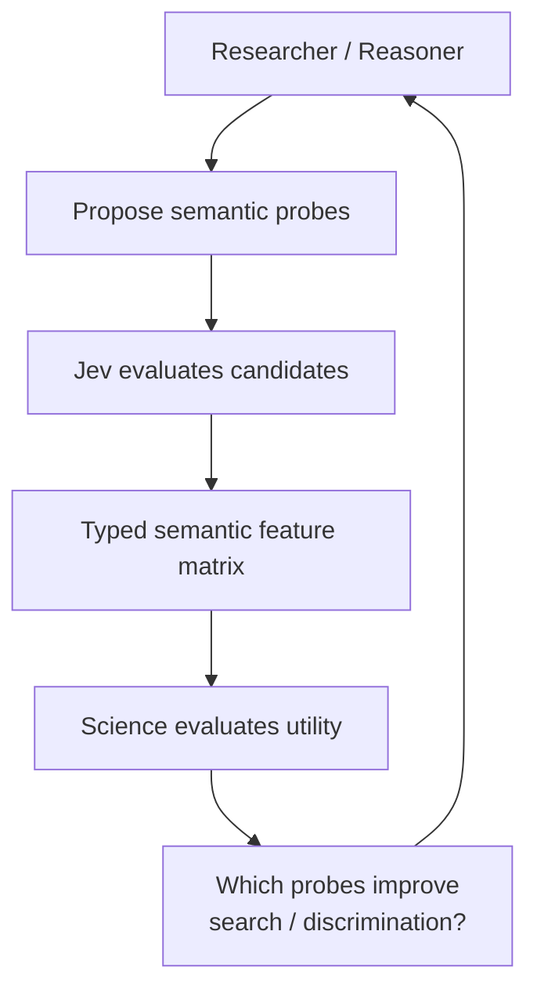

Potential semantic probes:

```text
Does this candidate show cross-modal discordance?

Is this association plausibly subtype-driven?

Does this alteration appear functionally consistent with pathway activation?

Is the apparent signal likely to be biologically tautological?

Does this candidate display evidence patterns characteristic of known artefacts?
```

Jev evaluates these at scale.

Science determines whether they actually improve discovery.

This creates a real experimental path for answering:

> Does Jev improve discovery efficiency?

---

# 22. Autoresearch must not self-promote capabilities

Reasoner-proposed semantic probes are experiments.

They do not become globally reusable simply because they produced an interesting result.

Required lifecycle:

```text
proposal
↓
LOCAL JevQuestionSpec
↓
evaluation
↓
repeated usefulness
↓
CANDIDATE
↓
independent validation
↓
VALIDATED
↓
governed promotion
↓
REUSABLE
```

No semantic capability self-promotes.

---

# 23. Self-consistency

The self-consistency cookbooks introduce an important requirement that should be explicit in OncoJev.

Semantic uncertainty must not silently become scientific rejection.

For a Noul:

```text
worth_followup = 0.53
```

this is not evidence that the candidate is unimportant.

For a Choice:

```text
method_A 0.43
method_B 0.39
```

this is not a strong basis for throwing method B away.

Canonical policy:

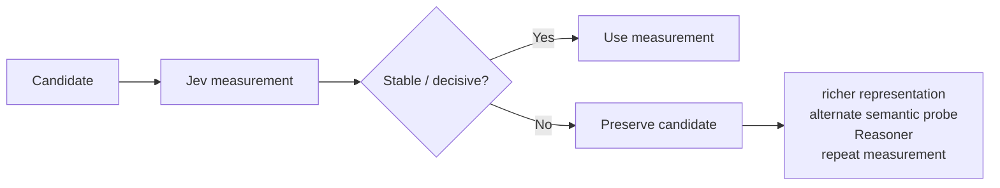

Important distinction:

```text
repeatability != correctness
```

Self-consistency can detect instability.

It does not prove scientific validity.

---

# 24. Confidence should control specificity

The classification-with-confidence cookbook provides a useful general rule.

Low confidence does not always mean:

```text
fail
```

It may mean:

```text
make a broader claim
```

For example:

```text
specific pathway mechanism uncertain
↓
retain broader oxidative-stress mechanism class
```

or:

```text
exact capability uncertain
↓
retain capability family
```

or:

```text
exact schema field uncertain
↓
retain schema branch
```

This gives OncoJev adaptive semantic resolution.

---

# 25. Confidence is not correctness probability

This must be explicit.

A Choice or Score confidence value should not automatically be interpreted as:

```text
P(answer is correct)
```

without empirical calibration.

Therefore:

- thresholds belong to particular semantic capabilities;
- thresholds should be evaluated against labelled examples where possible;
- model-version changes should trigger reevaluation;
- high-consequence pruning requires more conservative policy;
- candidate-recall sensitivity matters more than generic accuracy.

There should be no global:

```text
JEV_CONFIDENCE_THRESHOLD = 0.7
```

architecture.

---

# 26. Guardrails become epistemic guardrails

The LLM guardrail cookbook maps to a valuable scientific function.

Reasoner output may be checked before entering the Dossier.

Possible questions:

```text
Does this statement assert causation beyond the supplied evidence?

Does it convert association into mechanism?

Does it treat source failure as biological absence?

Does it generalize outside the measured cohort?

Does it describe speculation as observation?

Does it appear supported by the cited ScientificEvidence?
```

Architecture:

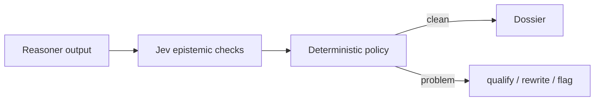

This does not create evidence.

It reduces semantic overstatement.

---

# 27. Citation checking

The citation cookbook gives a clean Dossier validation boundary.

Suppose a Dossier contains:

```text
Candidate X demonstrated strong survival association
and cross-modal support.
```

Validation:

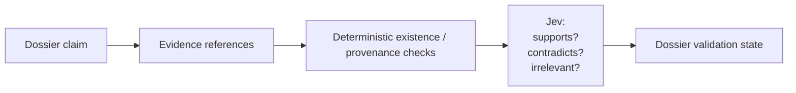

The deterministic layer verifies:

```text
Does the evidence object exist?
Does the reference resolve?
Is provenance intact?
Is the referenced measurement actually associated with this block?
```

Jev evaluates semantic support.

Neither operation creates new ScientificEvidence.

---

# 28. RAG passage classification

The RAG cookbook maps naturally onto Director memory and document retrieval.

After deterministic retrieval, Jev can evaluate:

```text
relevant?
contains required evidence?
contradicts premise?
contains adversarial / irrelevant instructions?
```

For OncoJev, this is useful for:

- Research Memory;
- literature passages;
- documentation;
- capability descriptions;
- source documentation;
- selected upstream content.

But it remains a filter.

It is not a security boundary or evidence generator.

---

# 29. Function calling

The TypeSafe function-calling cookbook should not replace Deep Agents tool use.

OncoJev already has an agent runtime.

Correct use:

```text
Jev:
Which bounded capability appears semantically applicable?

Researcher:
I select capability X.

Science:
I execute X.
```

Incorrect use:

```text
Jev
↓
executes capability
```

Useful closed sets may include:

```text
fisher_exact
logistic_regression
cox
permutation

or

metadata
aggregate
case_level
sample_level
raw

or

source_A
source_B
source_C
```

Open-ended arguments should remain with deterministic parsers or Reasoner-assisted extraction.

---

# 30. Intent routing

Intent routing exists, but it should not become the Researcher's control loop.

A bad architecture would be:

```text
Research need
↓
Jev chooses Science / Reasoner / Retrieval / Capability Search
↓
Researcher follows
```

This duplicates the Researcher's responsibility.

A narrow use is acceptable:

```text
Given this already identified need,
which handler family is semantically appropriate?
```

For example:

```text
exact deterministic computation
semantic comparison
open-ended generation
source retrieval
```

Treat this as optional.

Not core.

---

# 31. Pre-parsed extraction

This cookbook expresses another excellent OncoJev principle:

> deterministic code should over-generate candidate values; Jev should select semantically among them.

For example:

```text
source schema parser
↓
candidate fields
↓
Jev selects fields relevant to requested scientific concept
```

or:

```text
entity parser
↓
candidate entity IDs
↓
Jev evaluates which entity best corresponds to the concept
```

Critical consequence:

> candidate-generation recall becomes an upper bound.

Jev cannot recover an option the deterministic stage never supplied.

That principle applies across OncoJev.

---

# 32. Date extraction

The date cookbook demonstrates the exact boundary between semantic interpretation and deterministic execution.

Jev may determine:

```text
explicit date?
relative date?
which weekday?
which month?
```

Code performs:

```text
calendar arithmetic
timezone resolution
validity checks
```

The general lesson for OncoJev is broader:

> Jev identifies semantics; code executes formal transformations.

---

# 33. Structure recovery

Structure recovery is useful but not part of the core scientific architecture.

Potential location:

```text
Scientific Capability Registry
└── sources/
    └── document/
        └── structure_recovery
```

Potential uses:

- extracted paper text;
- malformed reports;
- OCR output;
- upstream documentation;
- old protocol documents.

It should remain a source-ingestion capability.

---

# 34. Parallel questions

Parallel questions should be one of the standard Jev invocation strategies.

Suppose a candidate has one state:

```text
candidate identity
statistical results
modalities
missingness
diagnostics
cohort properties
known biological annotations
```

Ask independent questions together:

```text
unusual?
cross-modal?
trivial?
contradicted?
missingness-dominated?
worth richer evidence?
```

Do not make six sequential model calls unless later answers actually depend on earlier ones.

Canonical interface:

```text
jev.evaluate(
    state=CandidateSemanticState,
    questions={
        "unusual": ...,
        "cross_modal": ...,
        "trivial": ...,
        "contradicted": ...,
        "missingness": ...,
        "followup_value": ...
    }
)
```

This should become the normal Jev path.

---

# 35. Composite scoring

Composite semantic measurements should generally be assembled in deterministic code.

For example:

```text
unusual = 0.82
cross_modal = 0.91
trivial = 0.22
missingness_artifact = 0.08
contradiction = 0.31
```

Python may then implement frontier policy.

But avoid pretending there is a scientifically universal equation such as:

```text
score = 0.4 * unusual + 0.6 * cross_modal
```

unless empirically justified.

Often the right result is not a scalar ranking.

It is a frontier classification:

```text
ADVANCE
KEEP_ALIVE
ESCALATE
DEFER
REJECT_RETAIN_PROVENANCE
```

---

# 36. Search frontier policy

This deserves to be a first-class OncoJev concept.

Jev produces semantic measurements.

A deterministic `FrontierPolicy` interprets them.

Conceptually:

```text
SemanticMeasurements
↓
FrontierPolicy
↓
ADVANCE
KEEP
ESCALATE
DEFER
REJECT
```

The Researcher can use the result but still owns strategy.

Important:

`REJECT` must retain provenance.

Nothing should disappear silently.

---

# 37. False-negative protection

The most dangerous Jev failure in OncoJev may be false-negative pruning.

Therefore the architecture should optimize not merely for:

```text
semantic precision
```

but for:

```text
valuable candidate recall
```

A candidate should not be removed merely because one semantic score is mediocre.

Possible protections:

```text
multi-dimensional semantic state
uncertainty preservation
beam/frontier retention
self-consistency checks
alternate semantic questions
representation escalation
Reasoner escalation
periodic rejected-candidate audits
```

This is fundamental to the scientific thesis.

---

# 38. Scientific Capability Registry versus Jev Capability Registry

Keep them separate.

Scientific Capability:

```text
executes something deterministic
```

Examples:

```text
gdc.search_cases
cohort.construct
statistics.fisher_exact
statistics.cox
multiple_testing.adjust
```

Jev Capability:

```text
measures a semantic property
```

Examples:

```text
candidate.cross_modal_coherence
method.estimand_match
memory.relevance
hypothesis.redundancy
dossier.evidence_support
```

Do not blur the two.

---

# 39. Skills versus capabilities

Also maintain:

```text
Skill
!=
Scientific Capability
!=
Jev Capability
```

A Skill teaches the Researcher:

```text
how or when to approach something
```

A Scientific Capability executes deterministic work.

A Jev Capability performs an evaluated reusable semantic measurement.

---

# 40. Jev execution failures

Operational SDK behaviour needs an epistemic invariant.

Possible failures:

```text
timeout
rate limit
transport failure
invalid request
SDK validation failure
model service failure
```

These must never become:

```text
negative semantic answer
```

Add:

> **Jev execution failure != negative semantic judgment.**

This parallels:

```text
source failure != biological absence
missing != zero
```

---

# 41. Jev telemetry

Each Jev execution should record enough metadata to reproduce and evaluate behaviour.

At minimum:

```text
call_id
block_id

model_requested
model_resolved

question_ids
question_versions
primitive_types

state_projection_id

typed answers
probability distributions
confidence where primitive-defined

execution duration
retry count

failure category

capabilities involved

frontier-policy result
```

Usage/resource telemetry can also be retained, but it should remain operational metadata rather than semantic evidence.

---

# 42. Model pinning

Reusable Jev capabilities should record the exact model version against which they were evaluated.

Moving aliases should not silently change scientific policy.

If the model changes:

```text
replay evaluation suite
↓
compare calibration / stability
↓
revalidate thresholds
↓
promote new version
```

Question version and model version both matter.

---

# 43. Self-consistency evaluation

Reusable Jev capabilities should be tested for at least three forms of stability:

```text
identical state repeated
irrelevant-field perturbation
semantically equivalent reformulation
```

This allows separation of:

```text
sampling instability
irrelevant-context sensitivity
prompt-form sensitivity
```

Repeatability is necessary but not sufficient.

---

# 44. Calibration

The TypeSafe documentation makes probability-like outputs central, but OncoJev should empirically calibrate important semantic capabilities against its own domain.

Useful evaluation concepts include:

```text
false-negative rate
false-positive rate
candidate recall
candidate precision
calibration error
stability
model-version drift
threshold sensitivity
```

Scientific search makes false negatives particularly important.

---

# 45. Dossier validation

Dossier generation should therefore have several layers.

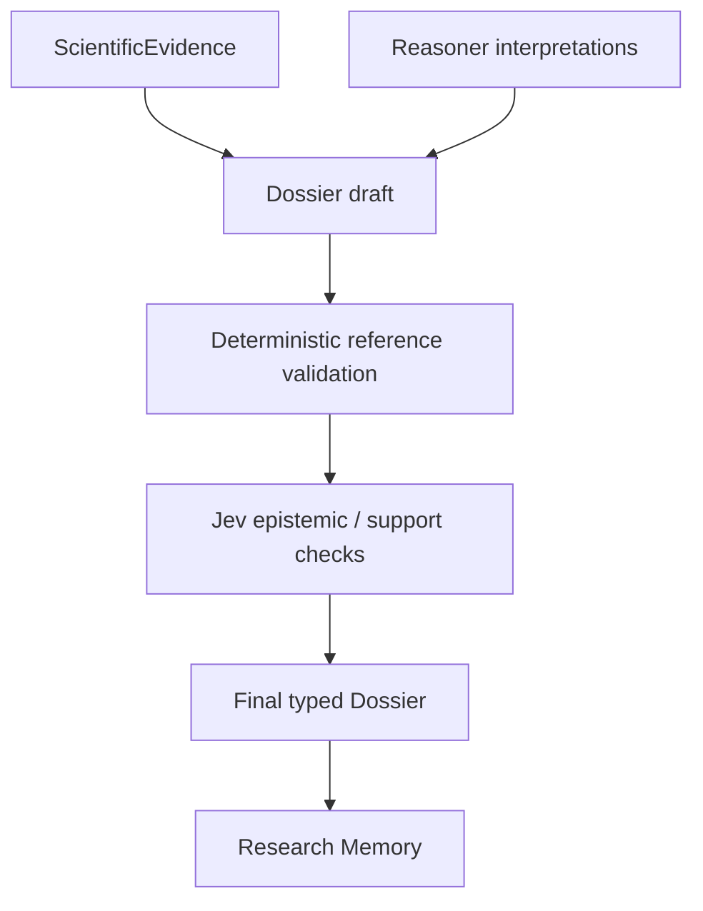

The final Dossier may contain interpretation and hypothesis material, but every statement should preserve its epistemic type.

For example:

```text
MEASURED
INTERPRETED
HYPOTHESIZED
CONTRADICTED
UNRESOLVED
NEGATIVE_RESULT
```

---

# 46. Hard invariants

The consolidated TypeSafe analysis strengthens the following invariants:

```text
JevDecision != ScientificEvidence

ReasonerOutput != ScientificEvidence

Researcher reasoning != ScientificEvidence

Generated code != ScientificEvidence

Dossier != ScientificEvidence

Only deterministic Science admission creates ScientificEvidence

Jev execution failure != negative semantic judgment

Source failure != biological absence

Missing != zero

Semantic uncertainty != scientific rejection

Choice winner != proof of suitability

Score != probability

Confidence != empirical correctness probability

Local JevQuestionSpec != reusable JevCapability

Local Scientific Capability != reusable Scientific Capability

Capability cannot self-promote

Researcher owns local investigation

Director owns global allocation

BlockManager owns block lifecycle and deadlines

Ledger is append-only
```

These should form part of `EPISTEMIC_CONSTITUTION.md`.

---

# 47. Cookbook → OncoJev canonical mapping

| TypeSafe pattern               | Canonical OncoJev role                              |
| ------------------------------ | --------------------------------------------------- |
| Parallel questions             | Default Jev execution pattern                       |
| Re-ranking                     | Director memory, candidate and capability reranking |
| Skill suggestion               | Scientific/Jev Capability Registry retrieval        |
| Self-consistency — Noul        | False-negative protection and semantic stability    |
| Self-consistency — Choice      | Detect ambiguous classification/selection           |
| Hierarchical classification    | GDC/schema/capability/ontology traversal            |
| Choice probabilities           | Search frontier / beam retention                    |
| Entity alignment               | Hypothesis, candidate and memory deduplication      |
| RAG passage classification     | Memory/document retrieval validation                |
| Semantic line search           | Targeted upstream/docs/paper inspection             |
| Function calling               | Closed-set capability compatibility only            |
| Classification with confidence | Adaptive specificity                                |
| Guardrails                     | Epistemic checks around Reasoner/Dossier            |
| Double-checking citations      | Evidence-support validation                         |
| SDE cascade                    | Semantic verification and selective escalation      |
| Pre-parsed extraction          | Deterministic enumeration → semantic selection      |
| Date extraction                | Semantic interpretation → deterministic execution   |
| Structure recovery             | Optional source-ingestion capability                |
| Autoresearch                   | Experimental discovery of useful semantic probes    |

---

# 48. What should be core at first

Do not implement every cookbook pattern immediately.

The first architecture should include only the patterns with direct structural importance.

## Core

```text
Noul / Choice / Score

structured state

structured criteria

parallel independent questions

primitive-native probability handling

deterministic composition

confidence / uncertainty routing

candidate reranking

capability reranking

Choice existence / NONE protection

search frontier preservation

JevQuestionSpec

separate JevCapability registry

error/failure semantics

telemetry

model/question versioning
```

---

# 49. Add shortly afterwards

```text
self-consistency tests

hierarchical/beam search

hypothesis entity alignment

Director memory reranking

citation/evidence support checks

epistemic guardrails

semantic line search

adaptive specificity
```

---

# 50. Experimental / later capabilities

```text
Autoresearch semantic feature discovery

intent routing

structure recovery

large-scale semantic taxonomy navigation

automatic capability-family discovery
```

These should be earned by real use.

---

# 51. What should not be adopted

Do not adopt TypeSafe patterns in ways that distort OncoJev.

Avoid:

```text
Jev controlling the Researcher loop

Jev executing scientific capabilities

Jev replacing Deep Agents tool calling

Jev deciding whether something becomes ScientificEvidence

Jev selecting one method from an unfiltered global catalogue

Jev analysing enormous raw candidate spaces without deterministic narrowing

Jev becoming an oracle over hypotheses

Jev turning confidence directly into scientific truth

Jev assigning one universal score to scientific importance
```

TypeSafe is a dependency.

It must not become the architecture.

---

# 52. Revised Researcher loop

The consolidated Researcher loop becomes:

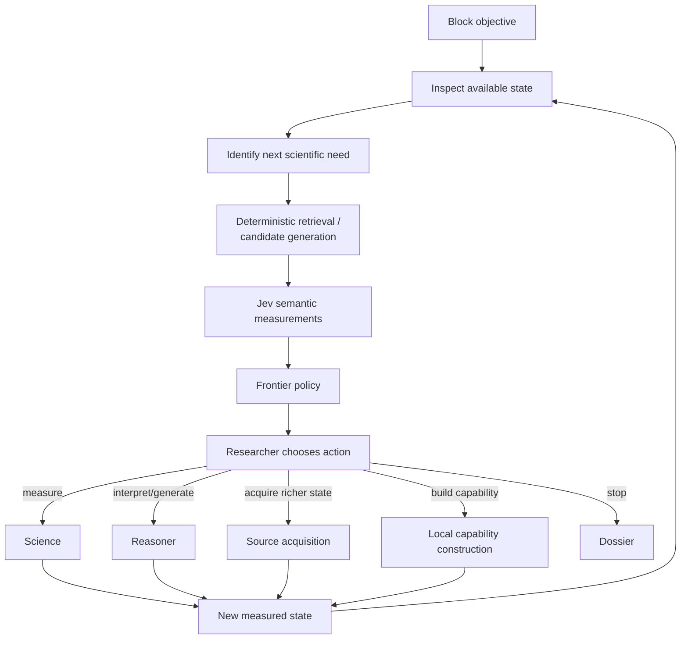

Jev does not form another loop beside the Researcher.

It is repeatedly invoked as a semantic measurement substrate inside the Researcher's loop.

---

# 53. Revised Director loop

Likewise:

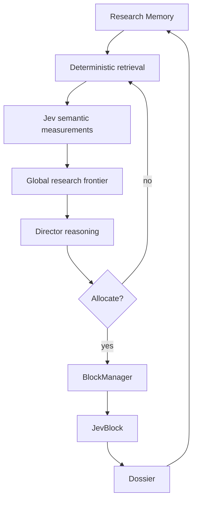

Director Jev is about global information compression and semantic comparison.

It is not Director replacement.

---

# 54. Revised candidate frontier

Candidate handling should explicitly distinguish:

```text
ADVANCE

KEEP_ALIVE

ESCALATE

DEFER

REJECT_RETAIN
```

`REJECT_RETAIN` is important.

A rejected candidate is still scientific history.

It should remain searchable because future evidence may make it relevant again.

This connects candidate search directly to Director memory.

---

# 55. Revised hypothesis frontier

Similarly:

```text
ACTIVE
PLAUSIBLE_ALTERNATIVE
WEAKENED
CONTRADICTED
REDUNDANT
BLOCKED
REJECTED_RETAINED
```

Jev may contribute measurements that affect these states.

It does not independently assign scientific truth.

---

# 56. Revised evaluation thesis

The main research question should not merely be:

> Does Jev improve performance?

It should be:

> **Does high-throughput typed semantic measurement allow an autonomous scientific system to reduce large biological search spaces while preserving valuable recall and improving scientifically useful discovery per unit research allocation?**

The correct comparison is:

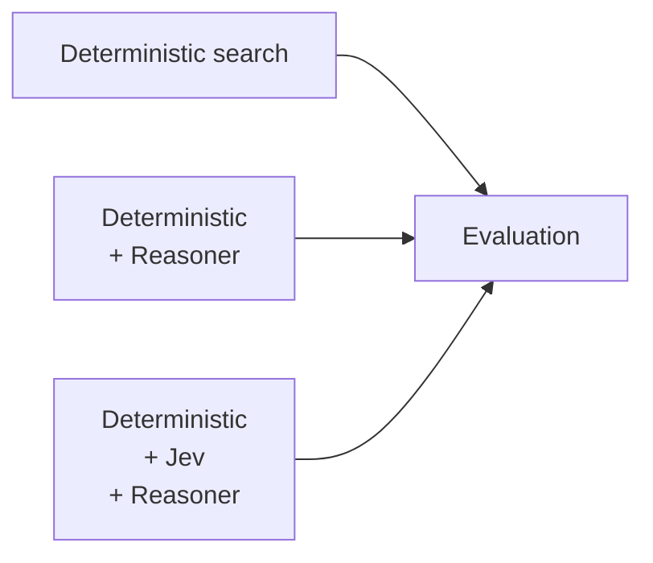

Measure at least:

```text
valuable candidate recall

scientifically useful candidates discovered

false-negative pruning

false-positive escalation

semantic-question utility

Reasoner escalation frequency

scientific analyses required

data acquisition required

wall-clock research time

search-frontier breadth

hypothesis diversity

duplicate-hypothesis suppression

capability reuse

representation escalation

Dossier evidence-support quality
```

The goal is not simply lower computational resource use.

It is better **research allocation**.

---

# 57. Evaluation of semantic probes

Each reusable semantic capability should eventually answer:

```text
What decision does this semantic measurement improve?

Against what labelled/evaluated corpus was it tested?

What is its false-negative behaviour?

What happens under uncertainty?

What representation is required?

What model/version was tested?

How sensitive is it to wording?

Does it remain useful after deterministic baselines?

Does it improve downstream scientific search?
```

If those questions cannot be answered, keep the probe local.

---

# 58. The deepest architectural implication

The TypeSafe cookbooks suggest that OncoJev should not think of Jev as:

```text
a cheaper LLM
```

or:

```text
a classifier
```

or:

```text
a judge
```

The more useful abstraction is:

> **a high-throughput semantic feature generator over bounded structured states.**

This explains why the same three primitives can support:

```text
retrieval
reranking
taxonomy traversal
capability matching
candidate triage
hypothesis alignment
epistemic verification
representation escalation
semantic feature discovery
```

without Jev becoming an autonomous agent.

---

# 59. Final canonical architecture

The consolidated architecture is therefore:

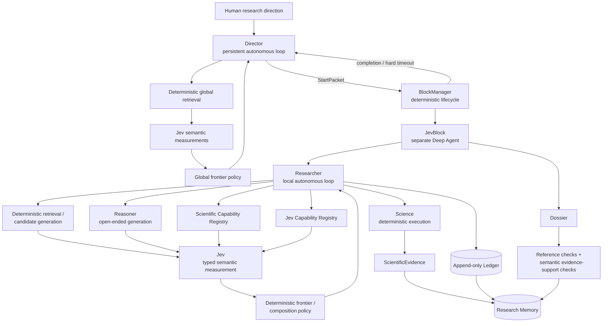

The corresponding epistemic hierarchy is:

```text
WORLD / DATA
    ↓
SCIENCE
    ↓
ScientificEvidence
    ↓
JEV
    ↓
semantic measurements
    ↓
RESEARCHER / DIRECTOR
    ↓
research actions

REASONER
    ↓
interpretations / hypotheses / tests
    ↓
JEV may evaluate bounded properties
    ↓
RESEARCHER
```

And the final operating principle becomes:

> **Science measures reality.**\
> **Jev measures semantics.**\
> **Reasoner generates possibilities.**\
> **Researcher decides how to investigate.**\
> **Director decides what deserves investigation.**\
> **Deterministic policy controls evidence, lifecycle and the search frontier.**

That should be the canonical conceptual model for TypeSafe/Jev inside OncoJev.

---

# 60. Final design judgement

The TypeSafe deep dive does not require a redesign of OncoJev.

It sharpens it.

The most important changes are:

1. Treat Jev explicitly as semantic measurement rather than generic judgement.
2. Put deterministic retrieval before Jev everywhere large spaces exist.
3. Put deterministic frontier policy after Jev everywhere pruning occurs.
4. Preserve complete probability distributions where they affect exploration.
5. Protect against false-negative pruning.
6. Separate local `JevQuestionSpec` from validated reusable `JevCapability`.
7. Make structured criteria part of semantic contracts.
8. Use parallel atomic questions as the default Jev execution pattern.
9. Use Choice distributions for beam/frontier preservation rather than only winner selection.
10. Add self-consistency and calibration to Jev capability validation.
11. Add semantic evidence-support checks around Dossiers.
12. Treat Jev execution failures as failures, never as negative judgements.
13. Use Autoresearch as an experimental mechanism for discovering useful semantic features, not as automatic capability promotion.
14. Keep TypeSafe subordinate to OncoJev's architecture.

The result is a cleaner system than a generic “LLM + tools + judge” architecture.

OncoJev becomes an autonomous search system in which large spaces are repeatedly narrowed through deterministic retrieval, semantic measurement and controlled frontier management, while expensive generative reasoning is reserved for the places where it can contribute something fundamentally different.
